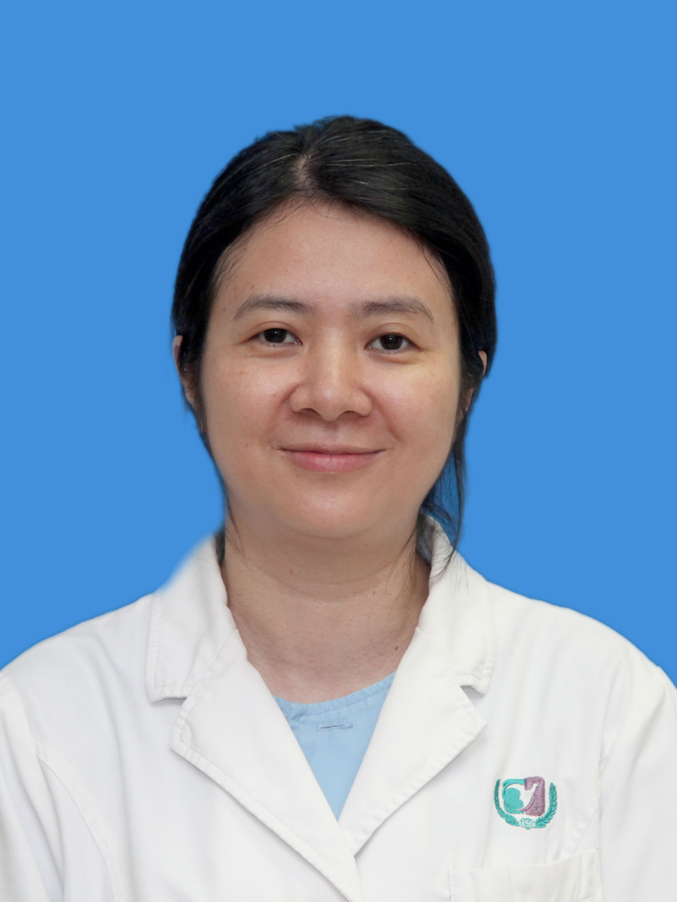

<!-- AUTO-GENERATED-BY: work/generate_obsidian_profiles.py -->

<!-- TEMPLATE: D:\workspace\信息收集整理\医生画像仓库\模板\医生画像模板.md -->

# 谢毅娟

## 基础信息

| 字段 | 内容 |
|---|---|
| 姓名 | 谢毅娟 |
| 医院 | 广州医科大学附属第三医院 |
| 科室 | 荔湾院区内分泌代谢科 |
| 职称/身份 | 副主任医师 |
| 来源链接 | [官网原文](https://www.gy3y.cn/ks/nkxt/nfmk/doctor_213.html) |
| 采集日期 | 2026-08-13 |

## 简介/擅长

长期从事内分泌代谢病临床工作，熟练掌握内分泌、代谢系统常见病，多发病的诊断和治疗，尤对糖尿病、甲状腺疾病、垂体-肾上腺疾病，女性内分泌代谢病等方面有较深造诣。

## 论文与学术产出

- 发表学术论文多篇。

## 可包装亮点

- 谢毅娟 内分泌学副主任医师，医学硕士。
- 兼任广东省药学会内分泌代谢用药专家委员会委员，广东省预防医学会内分泌代谢病防治专委会委员。
- 发表学术论文多篇。

## 重点疾病/人群标签

- 慢性病：糖尿病、代谢
- 肿瘤：
- 生殖疾病：
- 免疫/风湿：
- 术后恢复/康复：
- 疑难重症：

## 证据摘录

> 只摘录官网公开信息中的短句或关键字段，不复制大段原文。

- 官网身份字段：副主任医师
- 官网简介/擅长：长期从事内分泌代谢病临床工作，熟练掌握内分泌、代谢系统常见病，多发病的诊断和治疗，尤对糖尿病、甲状腺疾病、垂体-肾上腺疾病，女性内分泌代谢病等方面有较深造诣。
- 官网亮眼经历线索：谢毅娟 内分泌学副主任医师，医学硕士。 兼任广东省药学会内分泌代谢用药专家委员会委员，广东省预防医学会内分泌代谢病防治专委会委员。 发表学术论文多篇。
- 来源链接：https://www.gy3y.cn/ks/nkxt/nfmk/doctor_213.html

## BD 画像摘要

谢毅娟医生可作为慢性病方向的基础画像候选。后续 BD 使用应继续以官网来源和人工复核为准，不添加疗效承诺或无来源包装。

## 合规边界

- 仅使用医院官网、官方公众号、官方小程序等公开渠道。
- 不采集私人电话、私人微信、家庭住址、患者隐私或非公开排班信息。
- 不写“保证治愈”“疗效第一”“包治疑难杂症”等无法由官网证明的表述。
