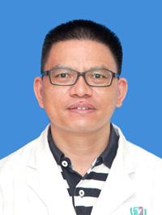

<!-- AUTO-GENERATED-BY: work/generate_obsidian_profiles.py -->

<!-- TEMPLATE: D:\workspace\信息收集整理\医生画像仓库\模板\医生画像模板.md -->

# 赖永通

## 基础信息

| 字段 | 内容 |
|---|---|
| 姓名 | 赖永通 |
| 医院 | 广州医科大学附属第三医院 |
| 科室 | 荔湾院区器官移植科 |
| 职称/身份 | 副主任医师 |
| 来源链接 | [官网原文](https://www.gy3y.cn/ks/wkxt/qgyzk/doctor_107.html) |
| 采集日期 | 2026-08-13 |

## 简介/擅长

肾脏移植手术，对肾移植术后各种并发症的诊断和治疗，尤其在肾移植术后感染、慢性移植肾肾病、免疫抑制剂应用及肾移植术后长期随访等方面具有独到的经验。

## 可包装亮点

- 赖永通 副主任医师。
- 从事泌尿外科肾移植专业20余年，现任广东省医师协会器官移植分会委员会，广东省医师协会泌尿生殖学会器官移植分会委员。

## 重点疾病/人群标签

- 慢性病：慢性、生殖、免疫、感染、术后
- 肿瘤：
- 生殖疾病：慢性、生殖、免疫、感染、术后
- 免疫/风湿：慢性、生殖、免疫、感染、术后
- 术后恢复/康复：慢性、生殖、免疫、感染、术后
- 疑难重症：

## 证据摘录

> 只摘录官网公开信息中的短句或关键字段，不复制大段原文。

- 官网身份字段：副主任医师
- 官网简介/擅长：肾脏移植手术，对肾移植术后各种并发症的诊断和治疗，尤其在肾移植术后感染、慢性移植肾肾病、免疫抑制剂应用及肾移植术后长期随访等方面具有独到的经验。
- 官网亮眼经历线索：赖永通 副主任医师。 从事泌尿外科肾移植专业20余年，现任广东省医师协会器官移植分会委员会，广东省医师协会泌尿生殖学会器官移植分会委员。
- 来源链接：https://www.gy3y.cn/ks/wkxt/qgyzk/doctor_107.html

## BD 画像摘要

赖永通医生可作为慢性病、生殖疾病、免疫/风湿/感染、术后恢复/康复方向的基础画像候选。后续 BD 使用应继续以官网来源和人工复核为准，不添加疗效承诺或无来源包装。

## 合规边界

- 仅使用医院官网、官方公众号、官方小程序等公开渠道。
- 不采集私人电话、私人微信、家庭住址、患者隐私或非公开排班信息。
- 不写“保证治愈”“疗效第一”“包治疑难杂症”等无法由官网证明的表述。
