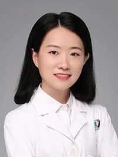

<!-- AUTO-GENERATED-BY: work/generate_obsidian_profiles.py -->

<!-- TEMPLATE: D:\workspace\信息收集整理\医生画像仓库\模板\医生画像模板.md -->

# 赵新

## 基础信息

| 字段 | 内容 |
|---|---|
| 姓名 | 赵新 |
| 医院 | 广州医科大学附属第三医院 |
| 科室 | 荔湾院区口腔科 |
| 职称/身份 | 副主任医师 |
| 来源链接 | [官网原文](https://www.gy3y.cn/ks/wgk/kqk/doctor_574.html) |
| 采集日期 | 2026-08-13 |

## 简介/擅长

种植牙，对各类阻生齿及复杂牙拔除术、牙槽外科手术具有较丰富的经验。开展BPS吸附性义齿、牙齿冷光美白、超薄瓷贴面修复等牙齿美容治疗。

## 教育与进修经历

- 赵 新 副主任医师 中山大学毕业，口腔临床医学硕士。

## 可包装亮点

- 赵 新 副主任医师 中山大学毕业，口腔临床医学硕士。
- 广东省医院协会口腔医疗管理分会委员，广东省口腔医学会老年口腔医学专业委员会委员，中华口腔医学会会员，广东省医学美容学会口腔医学会专业委员会委员，中国整形美容协会精准与数字医学分会颅颌面整复专业委员会委员。

## 重点疾病/人群标签

- 慢性病：
- 肿瘤：
- 生殖疾病：
- 免疫/风湿：
- 术后恢复/康复：
- 疑难重症：复杂

## 证据摘录

> 只摘录官网公开信息中的短句或关键字段，不复制大段原文。

- 官网身份字段：副主任医师
- 官网简介/擅长：种植牙，对各类阻生齿及复杂牙拔除术、牙槽外科手术具有较丰富的经验。开展BPS吸附性义齿、牙齿冷光美白、超薄瓷贴面修复等牙齿美容治疗。
- 官网亮眼经历线索：赵 新 副主任医师 中山大学毕业，口腔临床医学硕士。 广东省医院协会口腔医疗管理分会委员，广东省口腔医学会老年口腔医学专业委员会委员，中华口腔医学会会员，广东省医学美容学会口腔医学会专业委员会委员，中国整形美容协会精准与数字医学分会颅颌面整复专业委员会委员。
- 来源链接：https://www.gy3y.cn/ks/wgk/kqk/doctor_574.html

## BD 画像摘要

赵新医生可作为疑难重症方向的基础画像候选。后续 BD 使用应继续以官网来源和人工复核为准，不添加疗效承诺或无来源包装。

## 合规边界

- 仅使用医院官网、官方公众号、官方小程序等公开渠道。
- 不采集私人电话、私人微信、家庭住址、患者隐私或非公开排班信息。
- 不写“保证治愈”“疗效第一”“包治疑难杂症”等无法由官网证明的表述。
