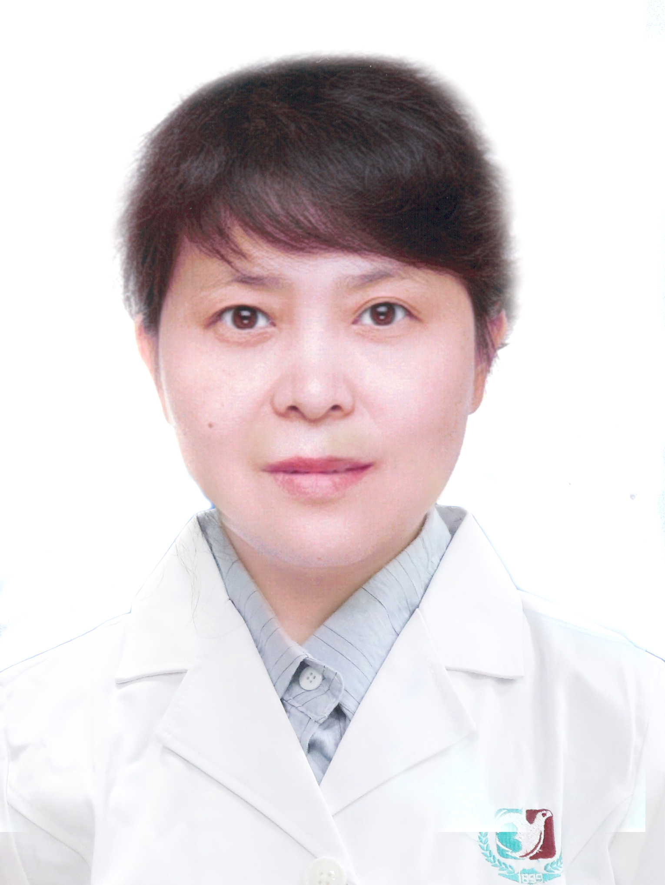

<!-- AUTO-GENERATED-BY: work/generate_obsidian_profiles.py -->

<!-- TEMPLATE: D:\workspace\信息收集整理\医生画像仓库\模板\医生画像模板.md -->

# 赵杨

## 基础信息

| 字段 | 内容 |
|---|---|
| 姓名 | 赵杨 |
| 医院 | 广州医科大学附属第三医院 |
| 科室 | 荔湾院区妇 科 |
| 职称/身份 | 主任医师、教授 |
| 来源链接 | [官网原文](https://www.gy3y.cn/ks/fckyjs/fk/doctor_325.html) |
| 采集日期 | 2026-08-13 |

## 简介/擅长

妇科良、恶性肿瘤尤其是宫颈病变的诊断和治疗。

## 教育与进修经历

- 赵 杨 ，教授，主任医师，博士生导师，1995年中国医科大学毕业后于中国医科大学附属第一医院妇科工作二十余年，任主任医师，教授及妇科副主任。

## 科研项目与成果

- 现任国家自然科学基金委评审专家、广东省基层医药学会妇科肿瘤专业委员会副主任委员。

## 可包装亮点

- 赵 杨 ，教授，主任医师，博士生导师，1995年中国医科大学毕业后于中国医科大学附属第一医院妇科工作二十余年，任主任医师，教授及妇科副主任。
- 针对卵巢癌的系列研究获首届全国妇幼健康科技二等奖。
- 现任国家自然科学基金委评审专家、广东省基层医药学会妇科肿瘤专业委员会副主任委员。

## 重点疾病/人群标签

- 慢性病：
- 肿瘤：肿瘤、癌、卵巢
- 生殖疾病：肿瘤、癌、卵巢
- 免疫/风湿：
- 术后恢复/康复：
- 疑难重症：

## 证据摘录

> 只摘录官网公开信息中的短句或关键字段，不复制大段原文。

- 官网身份字段：主任医师、教授
- 官网简介/擅长：妇科良、恶性肿瘤尤其是宫颈病变的诊断和治疗。
- 官网亮眼经历线索：赵 杨 ，教授，主任医师，博士生导师，1995年中国医科大学毕业后于中国医科大学附属第一医院妇科工作二十余年，任主任医师，教授及妇科副主任。 针对卵巢癌的系列研究获首届全国妇幼健康科技二等奖。 现任国家自然科学基金委评审专家、广东省基层医药学会妇科肿瘤专业委员会副主任委员。
- 来源链接：https://www.gy3y.cn/ks/fckyjs/fk/doctor_325.html

## BD 画像摘要

赵杨医生可作为肿瘤、生殖疾病方向的基础画像候选。后续 BD 使用应继续以官网来源和人工复核为准，不添加疗效承诺或无来源包装。

## 合规边界

- 仅使用医院官网、官方公众号、官方小程序等公开渠道。
- 不采集私人电话、私人微信、家庭住址、患者隐私或非公开排班信息。
- 不写“保证治愈”“疗效第一”“包治疑难杂症”等无法由官网证明的表述。
