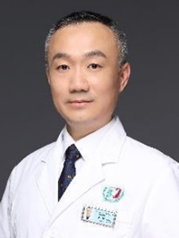

<!-- AUTO-GENERATED-BY: work/generate_obsidian_profiles.py -->

<!-- TEMPLATE: D:\workspace\信息收集整理\医生画像仓库\模板\医生画像模板.md -->

# 邵明

## 基础信息

| 字段 | 内容 |
|---|---|
| 姓名 | 邵明 |
| 医院 | 广州医科大学附属第三医院 |
| 科室 | 荔湾院区创伤骨科、黄埔院区骨科 |
| 职称/身份 | 主任医师、教授 |
| 来源链接 | [官网原文](https://www.gy3y.cn/ks/wkxt/csgk/doctor_337.html) |
| 采集日期 | 2026-08-13 |

## 简介/擅长

颈椎病、腰椎间盘突出症、骨性关节炎、四肢骨病等骨科疾病诊治。擅长脊柱、关节、骨盆、四肢的创伤救治，手术速度快、质量高、更加微创、治疗效果好。

## 教育与进修经历

- 详细介绍： 临床医学博士、生物学博士后，硕士研究生导师，主任医师；

## 可包装亮点

- 邵明 创伤骨科 主任医师 擅长领域：颈椎病、腰椎间盘突出症、骨性关节炎、四肢骨病等骨科疾病诊治。
- 详细介绍： 临床医学博士、生物学博士后，硕士研究生导师，主任医师；
- 广州医科大学附属第三医院创伤骨科主任（引进人才），兼任中华医学会创伤分会全国委员，中华医学会老年医学分会全国委员（并老年创伤协作组委员），中国医师协会创伤外科医师分会全国委员，中国医师协会骨科分会全国委员，SICOT中国部创伤学会委员，广州市医学会骨科分会副主任委员，广东省医学会创伤分会常委，广东省医学会骨科分会常委，广东省医疗行业协会骨质疏松管理分会常委…

## 重点疾病/人群标签

- 慢性病：
- 肿瘤：
- 生殖疾病：
- 免疫/风湿：
- 术后恢复/康复：
- 疑难重症：

## 证据摘录

> 只摘录官网公开信息中的短句或关键字段，不复制大段原文。

- 官网身份字段：主任医师、教授
- 官网简介/擅长：颈椎病、腰椎间盘突出症、骨性关节炎、四肢骨病等骨科疾病诊治。擅长脊柱、关节、骨盆、四肢的创伤救治，手术速度快、质量高、更加微创、治疗效果好。
- 官网亮眼经历线索：邵明 创伤骨科 主任医师 擅长领域：颈椎病、腰椎间盘突出症、骨性关节炎、四肢骨病等骨科疾病诊治。 详细介绍： 临床医学博士、生物学博士后，硕士研究生导师，主任医师； 广州医科大学附属第三医院创伤骨科主任（引进人才），兼任中华医学会创伤分会全国委员，中华医学会老年医学分会全国委员（并老年创伤协作组委员），中国医师协会创伤外科医师分会全国委员，中国医师协会骨科分会全国委员，SICOT中国部创伤学会委员，广州市医学会骨科分会副主任委员，广东…
- 来源链接：https://www.gy3y.cn/ks/wkxt/csgk/doctor_337.html

## BD 画像摘要

邵明医生可作为广州医科大学附属第三医院荔湾院区创伤骨科、黄埔院区骨科的基础医生资料入库。当前重点方向以总底表标签为准，官网未展示的信息保持空白。

## 合规边界

- 仅使用医院官网、官方公众号、官方小程序等公开渠道。
- 不采集私人电话、私人微信、家庭住址、患者隐私或非公开排班信息。
- 不写“保证治愈”“疗效第一”“包治疑难杂症”等无法由官网证明的表述。
