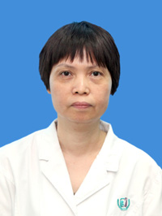

<!-- AUTO-GENERATED-BY: work/generate_obsidian_profiles.py -->

<!-- TEMPLATE: D:\workspace\信息收集整理\医生画像仓库\模板\医生画像模板.md -->

# 郭小云

## 基础信息

| 字段 | 内容 |
|---|---|
| 姓名 | 郭小云 |
| 医院 | 广州医科大学附属第三医院 |
| 科室 | 荔湾院区中医科 |
| 职称/身份 | 主任中医师 |
| 来源链接 | [官网原文](https://www.gy3y.cn/ks/zyk/zyk1/doctor_156.html) |
| 采集日期 | 2026-08-13 |

## 简介/擅长

针灸治疗不孕不育、辅助生育（改善精子、卵子质量，改善内膜厚度及容受性，提高着床率等）、卵巢早衰、妇科病（月经病、子宫肌瘤、多囊卵巢综合征、卵巢过激综合症、妊娠病等）、颈椎病、各种痛证、乳腺病、咳喘、睡眠障碍、中风后遗症、肥胖病等。

## 教育与进修经历

- 现任广东省针灸学会常务理事、广东省针灸学会针法专业委员会常务委员、广东省针灸学会技术评估委员会技术培训专家等。

## 可包装亮点

- 从事中医针灸临床30余年，入选2018年度和2019年度岭南名医录。
- 曾任中国针灸学会腹针专业委员会委员，广东省针灸学会董氏奇穴专业委员会副主任委员、减肥及内分泌专业委员会副主任委员，广州市中医药学会针灸专业副主任委员，广东省医学会医疗事故技术鉴定专家库成员，广州市医学会医疗事故技术鉴定专家库成员等。
- 现任广东省针灸学会常务理事、广东省针灸学会针法专业委员会常务委员、广东省针灸学会技术评估委员会技术培训专家等。

## 重点疾病/人群标签

- 慢性病：
- 肿瘤：瘤、不孕、卵巢、多囊、月经
- 生殖疾病：瘤、不孕、卵巢、多囊、月经
- 免疫/风湿：
- 术后恢复/康复：
- 疑难重症：

## 证据摘录

> 只摘录官网公开信息中的短句或关键字段，不复制大段原文。

- 官网身份字段：主任中医师
- 官网简介/擅长：针灸治疗不孕不育、辅助生育（改善精子、卵子质量，改善内膜厚度及容受性，提高着床率等）、卵巢早衰、妇科病（月经病、子宫肌瘤、多囊卵巢综合征、卵巢过激综合症、妊娠病等）、颈椎病、各种痛证、乳腺病、咳喘、睡眠障碍、中风后遗症、肥胖病等。
- 官网亮眼经历线索：从事中医针灸临床30余年，入选2018年度和2019年度岭南名医录。 曾任中国针灸学会腹针专业委员会委员，广东省针灸学会董氏奇穴专业委员会副主任委员、减肥及内分泌专业委员会副主任委员，广州市中医药学会针灸专业副主任委员，广东省医学会医疗事故技术鉴定专家库成员，广州市医学会医疗事故技术鉴定专家库成员等。 现任广东省针灸学会常务理事、广东省针灸学会针法专业委员会常务委员、广东省针灸学会技术评估委员会技术培训专家等。
- 来源链接：https://www.gy3y.cn/ks/zyk/zyk1/doctor_156.html

## BD 画像摘要

郭小云医生可作为肿瘤、生殖疾病方向的基础画像候选。后续 BD 使用应继续以官网来源和人工复核为准，不添加疗效承诺或无来源包装。

## 合规边界

- 仅使用医院官网、官方公众号、官方小程序等公开渠道。
- 不采集私人电话、私人微信、家庭住址、患者隐私或非公开排班信息。
- 不写“保证治愈”“疗效第一”“包治疑难杂症”等无法由官网证明的表述。
