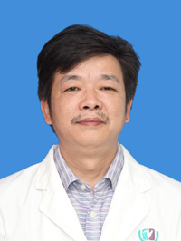

<!-- AUTO-GENERATED-BY: work/generate_obsidian_profiles.py -->

<!-- TEMPLATE: D:\workspace\信息收集整理\医生画像仓库\模板\医生画像模板.md -->

# 郭雪坤

## 基础信息

| 字段 | 内容 |
|---|---|
| 姓名 | 郭雪坤 |
| 医院 | 广州医科大学附属第三医院 |
| 科室 | 荔湾院区器官移植科 |
| 职称/身份 | 副主任医师 |
| 来源链接 | [官网原文](https://www.gy3y.cn/ks/wkxt/qgyzk/doctor_106.html) |
| 采集日期 | 2026-08-13 |

## 简介/擅长

精通血液灌流抢救重症药物中毒、深静脉置管技术、动静脉內瘘术、腹膜透析置管术等。

## 教育与进修经历

- 1988年毕业于湘雅医科大学医疗系，历任湖南省益阳市人民医院肾移植血液透析中心主任、湖南省器官移植学会第一届常务委员，2003年评为湖南省卫生系统劳动模范，广州市器官移植学会第一届、第二届委员，第三届常委。

## 论文与学术产出

- 先后在《中国医师杂志》、《中国现代医学杂志》等刊物上发辫论文10余篇。

## 可包装亮点

- 郭雪坤， 副主任医师。
- 1988年毕业于湘雅医科大学医疗系，历任湖南省益阳市人民医院肾移植血液透析中心主任、湖南省器官移植学会第一届常务委员，2003年评为湖南省卫生系统劳动模范，广州市器官移植学会第一届、第二届委员，第三届常委。

## 重点疾病/人群标签

- 慢性病：
- 肿瘤：
- 生殖疾病：
- 免疫/风湿：
- 术后恢复/康复：
- 疑难重症：重症

## 证据摘录

> 只摘录官网公开信息中的短句或关键字段，不复制大段原文。

- 官网身份字段：副主任医师
- 官网简介/擅长：精通血液灌流抢救重症药物中毒、深静脉置管技术、动静脉內瘘术、腹膜透析置管术等。
- 官网亮眼经历线索：郭雪坤， 副主任医师。 1988年毕业于湘雅医科大学医疗系，历任湖南省益阳市人民医院肾移植血液透析中心主任、湖南省器官移植学会第一届常务委员，2003年评为湖南省卫生系统劳动模范，广州市器官移植学会第一届、第二届委员，第三届常委。
- 来源链接：https://www.gy3y.cn/ks/wkxt/qgyzk/doctor_106.html

## BD 画像摘要

郭雪坤医生可作为疑难重症方向的基础画像候选。后续 BD 使用应继续以官网来源和人工复核为准，不添加疗效承诺或无来源包装。

## 合规边界

- 仅使用医院官网、官方公众号、官方小程序等公开渠道。
- 不采集私人电话、私人微信、家庭住址、患者隐私或非公开排班信息。
- 不写“保证治愈”“疗效第一”“包治疑难杂症”等无法由官网证明的表述。
