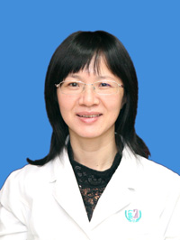

<!-- AUTO-GENERATED-BY: work/generate_obsidian_profiles.py -->

<!-- TEMPLATE: D:\workspace\信息收集整理\医生画像仓库\模板\医生画像模板.md -->

# 钟冬梅

## 基础信息

| 字段 | 内容 |
|---|---|
| 姓名 | 钟冬梅 |
| 医院 | 广州医科大学附属第三医院 |
| 科室 | 荔湾院区中医科 |
| 职称/身份 | 副主任中医师 |
| 来源链接 | [官网原文](https://www.gy3y.cn/ks/zyk/zyk1/doctor_160.html) |
| 采集日期 | 2026-08-13 |

## 简介/擅长

致力于不孕不育症和保胎方面的临床工作和研究，擅长中医和中西医结合治疗男女不孕不育症、多囊卵巢综合征、月经病、盆腔炎性疾病、乳腺病、更年期综合征、妊娠相关疾病以及合并出现的其它如咳嗽、失眠、湿疹、头晕、心悸、腰痛、消化道、泌尿道等不适症状，临床经验丰富，对于孕前或试管婴儿各阶段的中医调治和多囊卵巢综合征、卵巢功能衰退、薄型子宫内膜导致的不孕不育、以及卵巢过激综合证腹水的治疗颇有心得。

## 科研项目与成果

- 广州市优秀中医，从事临床工作 近三十 年，兼教学科研工作 十余 年，致力于不孕不育症和保胎方面的临床工作和研究，有较深的造诣，发表论文多篇和主持参与厅局级科研课题多项。

## 论文与学术产出

- 广州市优秀中医，从事临床工作 近三十 年，兼教学科研工作 十余 年，致力于不孕不育症和保胎方面的临床工作和研究，有较深的造诣，发表论文多篇和主持参与厅局级科研课题多项。

## 可包装亮点

- 广州市优秀中医，从事临床工作 近三十 年，兼教学科研工作 十余 年，致力于不孕不育症和保胎方面的临床工作和研究，有较深的造诣，发表论文多篇和主持参与厅局级科研课题多项。

## 重点疾病/人群标签

- 慢性病：
- 肿瘤：
- 生殖疾病：不孕、卵巢、试管、多囊、月经
- 免疫/风湿：
- 术后恢复/康复：
- 疑难重症：

## 证据摘录

> 只摘录官网公开信息中的短句或关键字段，不复制大段原文。

- 官网身份字段：副主任中医师
- 官网简介/擅长：致力于不孕不育症和保胎方面的临床工作和研究，擅长中医和中西医结合治疗男女不孕不育症、多囊卵巢综合征、月经病、盆腔炎性疾病、乳腺病、更年期综合征、妊娠相关疾病以及合并出现的其它如咳嗽、失眠、湿疹、头晕、心悸、腰痛、消化道、泌尿道等不适症状，临床经验丰富，对于孕前或试管婴儿各阶段的中医调治和多囊卵巢综合征、卵巢功能衰退、薄型子宫内膜导致的不孕不育、以及卵巢过激综合证腹水的治疗颇有心得。
- 官网亮眼经历线索：广州市优秀中医，从事临床工作 近三十 年，兼教学科研工作 十余 年，致力于不孕不育症和保胎方面的临床工作和研究，有较深的造诣，发表论文多篇和主持参与厅局级科研课题多项。
- 来源链接：https://www.gy3y.cn/ks/zyk/zyk1/doctor_160.html

## BD 画像摘要

钟冬梅医生可作为生殖疾病方向的基础画像候选。后续 BD 使用应继续以官网来源和人工复核为准，不添加疗效承诺或无来源包装。

## 合规边界

- 仅使用医院官网、官方公众号、官方小程序等公开渠道。
- 不采集私人电话、私人微信、家庭住址、患者隐私或非公开排班信息。
- 不写“保证治愈”“疗效第一”“包治疑难杂症”等无法由官网证明的表述。
