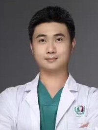

<!-- AUTO-GENERATED-BY: work/generate_obsidian_profiles.py -->

<!-- TEMPLATE: D:\workspace\信息收集整理\医生画像仓库\模板\医生画像模板.md -->

# 陆文嘉

## 基础信息

| 字段 | 内容 |
|---|---|
| 姓名 | 陆文嘉 |
| 医院 | 广州医科大学附属第三医院 |
| 科室 | 荔湾院区口腔科 |
| 职称/身份 | 主治医师 |
| 来源链接 | [官网原文](https://www.gy3y.cn/ks/wgk/kqk/doctor_577.html) |
| 采集日期 | 2026-08-13 |

## 简介/擅长

口腔全科各种常见病、多发病的诊治。对智齿拔除，口腔各种活动义齿、固定义齿修复有丰富的经验。

## 教育与进修经历

- 陆文嘉 主治医师 毕业于中山大学光华口腔医学院。
- 曾于光华口腔医院进修口腔修复专业。

## 可包装亮点

- 曾于光华口腔医院进修口腔修复专业。

## 重点疾病/人群标签

- 慢性病：
- 肿瘤：
- 生殖疾病：
- 免疫/风湿：
- 术后恢复/康复：
- 疑难重症：

## 证据摘录

> 只摘录官网公开信息中的短句或关键字段，不复制大段原文。

- 官网身份字段：主治医师
- 官网简介/擅长：口腔全科各种常见病、多发病的诊治。对智齿拔除，口腔各种活动义齿、固定义齿修复有丰富的经验。
- 官网亮眼经历线索：曾于光华口腔医院进修口腔修复专业。
- 来源链接：https://www.gy3y.cn/ks/wgk/kqk/doctor_577.html

## BD 画像摘要

陆文嘉医生可作为广州医科大学附属第三医院荔湾院区口腔科的基础医生资料入库。当前重点方向以总底表标签为准，官网未展示的信息保持空白。

## 合规边界

- 仅使用医院官网、官方公众号、官方小程序等公开渠道。
- 不采集私人电话、私人微信、家庭住址、患者隐私或非公开排班信息。
- 不写“保证治愈”“疗效第一”“包治疑难杂症”等无法由官网证明的表述。
