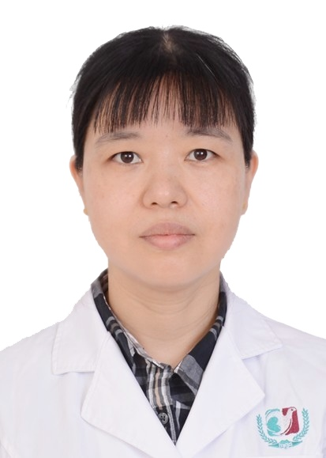

<!-- AUTO-GENERATED-BY: work/generate_obsidian_profiles.py -->

<!-- TEMPLATE: D:\workspace\信息收集整理\医生画像仓库\模板\医生画像模板.md -->

# 陈永铃

## 基础信息

| 字段 | 内容 |
|---|---|
| 姓名 | 陈永铃 |
| 医院 | 广州医科大学附属第三医院 |
| 科室 | 荔湾院区眼 科、黄埔院区眼科 |
| 职称/身份 | 副主任医师 |
| 来源链接 | [官网原文](https://www.gy3y.cn/ks/wgk/yk/doctor_317.html) |
| 采集日期 | 2026-08-13 |

## 简介/擅长

熟练掌握眼科常见病，多发病的诊治，尤其擅长眼表、斜弱视和屈光不正的诊疗。

## 科研项目与成果

- 主持和参与基金5项，在期刊上发表眼科专业论文10余篇。

## 论文与学术产出

- 主持和参与基金5项，在期刊上发表眼科专业论文10余篇。

## 可包装亮点

- 陈永铃 ， 副主任医师、硕士研究生 长期从事眼科临床工作，熟练掌握眼科常见病，多发病的诊治，尤其擅长眼表、斜弱视和屈光不正的诊疗。
- 现任广东省保健协会视觉保健分会委员。
- 主持和参与基金5项，在期刊上发表眼科专业论文10余篇。

## 重点疾病/人群标签

- 慢性病：
- 肿瘤：
- 生殖疾病：
- 免疫/风湿：
- 术后恢复/康复：
- 疑难重症：

## 证据摘录

> 只摘录官网公开信息中的短句或关键字段，不复制大段原文。

- 官网身份字段：副主任医师
- 官网简介/擅长：熟练掌握眼科常见病，多发病的诊治，尤其擅长眼表、斜弱视和屈光不正的诊疗。
- 官网亮眼经历线索：陈永铃 ， 副主任医师、硕士研究生 长期从事眼科临床工作，熟练掌握眼科常见病，多发病的诊治，尤其擅长眼表、斜弱视和屈光不正的诊疗。 现任广东省保健协会视觉保健分会委员。 主持和参与基金5项，在期刊上发表眼科专业论文10余篇。
- 来源链接：https://www.gy3y.cn/ks/wgk/yk/doctor_317.html

## BD 画像摘要

陈永铃医生可作为广州医科大学附属第三医院荔湾院区眼 科、黄埔院区眼科的基础医生资料入库。当前重点方向以总底表标签为准，官网未展示的信息保持空白。

## 合规边界

- 仅使用医院官网、官方公众号、官方小程序等公开渠道。
- 不采集私人电话、私人微信、家庭住址、患者隐私或非公开排班信息。
- 不写“保证治愈”“疗效第一”“包治疑难杂症”等无法由官网证明的表述。
