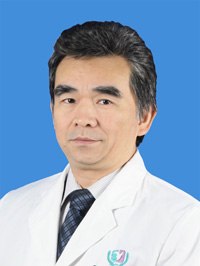

<!-- AUTO-GENERATED-BY: work/generate_obsidian_profiles.py -->

<!-- TEMPLATE: D:\workspace\信息收集整理\医生画像仓库\模板\医生画像模板.md -->

# 陈耀勇

## 基础信息

| 字段 | 内容 |
|---|---|
| 姓名 | 陈耀勇 |
| 医院 | 广州医科大学附属第三医院 |
| 科室 | 荔湾院区儿 科（普通儿科、新生儿科）、黄埔院区儿科 |
| 职称/身份 | 主任医师、教授 |
| 来源链接 | [官网原文](https://www.gy3y.cn/ks/ek/ek1/doctor_149.html) |
| 采集日期 | 2026-08-13 |

## 简介/擅长

重点研究方向儿童内分泌与代谢疾病诊治等。对儿童糖尿病、甲状腺功能障碍、矮小症等疾病的诊治有较深造诣。

## 科研项目与成果

- 近年来，承担国家、省市研究项目10余项，发表学术论著30余篇，出版学术专著5部，获得广东省科技进步奖、广东省医药科技进步奖各1项。

## 论文与学术产出

- 近年来，承担国家、省市研究项目10余项，发表学术论著30余篇，出版学术专著5部，获得广东省科技进步奖、广东省医药科技进步奖各1项。

## 可包装亮点

- 陈耀勇，医学博士，医院纪委书记，教授、主任医师、硕士研究生导师。
- 任广东省医学会围产医学分会副主委、中国妇幼保健协会出生缺陷防治与分子遗传分会副主任委员、妇儿健康标准与规范委员会副主委，广东省医院协会医院科教专业委员会副主委、医院药事管理专业委员会常务委员，广东省医学会罕见病学分会常务委员；
- 广州市医学会、医师协会常务理事。
- 近年来，承担国家、省市研究项目10余项，发表学术论著30余篇，出版学术专著5部，获得广东省科技进步奖、广东省医药科技进步奖各1项。

## 重点疾病/人群标签

- 慢性病：糖尿病、代谢、功能障碍、罕见
- 肿瘤：
- 生殖疾病：
- 免疫/风湿：
- 术后恢复/康复：糖尿病、代谢、功能障碍、罕见
- 疑难重症：糖尿病、代谢、功能障碍、罕见

## 证据摘录

> 只摘录官网公开信息中的短句或关键字段，不复制大段原文。

- 官网身份字段：主任医师、教授
- 官网简介/擅长：重点研究方向儿童内分泌与代谢疾病诊治等。对儿童糖尿病、甲状腺功能障碍、矮小症等疾病的诊治有较深造诣。
- 官网亮眼经历线索：陈耀勇，医学博士，医院纪委书记，教授、主任医师、硕士研究生导师。 任广东省医学会围产医学分会副主委、中国妇幼保健协会出生缺陷防治与分子遗传分会副主任委员、妇儿健康标准与规范委员会副主委，广东省医院协会医院科教专业委员会副主委、医院药事管理专业委员会常务委员，广东省医学会罕见病学分会常务委员； 广州市医学会、医师协会常务理事。 近年来，承担国家、省市研究项目10余项，发表学术论著30余篇，出版学术专著5部，获得广东省科技进步奖、广东省医…
- 来源链接：https://www.gy3y.cn/ks/ek/ek1/doctor_149.html

## BD 画像摘要

陈耀勇医生可作为慢性病、术后恢复/康复、疑难重症方向的基础画像候选。后续 BD 使用应继续以官网来源和人工复核为准，不添加疗效承诺或无来源包装。

## 合规边界

- 仅使用医院官网、官方公众号、官方小程序等公开渠道。
- 不采集私人电话、私人微信、家庭住址、患者隐私或非公开排班信息。
- 不写“保证治愈”“疗效第一”“包治疑难杂症”等无法由官网证明的表述。
