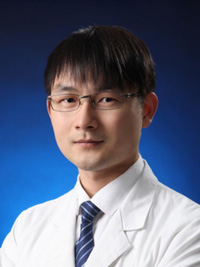

<!-- AUTO-GENERATED-BY: work/generate_obsidian_profiles.py -->

<!-- TEMPLATE: D:\workspace\信息收集整理\医生画像仓库\模板\医生画像模板.md -->

# 陈说

## 基础信息

| 字段 | 内容 |
|---|---|
| 姓名 | 陈说 |
| 医院 | 广州医科大学附属第三医院 |
| 科室 | 荔湾院区妇科肿瘤病区 |
| 职称/身份 | 教授、副主任医师 |
| 来源链接 | [官网原文](https://www.gy3y.cn/ks/fckyjs/fkzl/doctor_598.html) |
| 采集日期 | 2026-08-13 |

## 简介/擅长

宫颈病变、子宫肌瘤、子宫内膜病变、卵巢肿瘤等妇科良恶性肿瘤的诊疗。

## 科研项目与成果

- 针对妇科恶性肿瘤的发病机制进行深入研究，主持包括3项国家自然科学基金在内的科研项目10项，作为主要完成人获得包括全国妇幼健康科学技术奖二等奖在内的省部级奖项6项。

## 可包装亮点

- 医学博士，教授/副主任医师、博士生导师；
- 广东省青年科技人才培育对象、广州市高层次人才。
- 任中华医学会妇科肿瘤学分会青年学组委员、广东省医学会妇科肿瘤专委会青年委员会副主任委员、广东省基层医药学会妇科肿瘤专业委员会常务委员、广东省医师协会妇科肿瘤学分会委员等。
- 针对妇科恶性肿瘤的发病机制进行深入研究，主持包括3项国家自然科学基金在内的科研项目10项，作为主要完成人获得包括全国妇幼健康科学技术奖二等奖在内的省部级奖项6项。

## 重点疾病/人群标签

- 慢性病：
- 肿瘤：肿瘤、瘤、卵巢
- 生殖疾病：肿瘤、瘤、卵巢
- 免疫/风湿：
- 术后恢复/康复：
- 疑难重症：

## 证据摘录

> 只摘录官网公开信息中的短句或关键字段，不复制大段原文。

- 官网身份字段：教授、副主任医师
- 官网简介/擅长：宫颈病变、子宫肌瘤、子宫内膜病变、卵巢肿瘤等妇科良恶性肿瘤的诊疗。
- 官网亮眼经历线索：医学博士，教授/副主任医师、博士生导师； 广东省青年科技人才培育对象、广州市高层次人才。 任中华医学会妇科肿瘤学分会青年学组委员、广东省医学会妇科肿瘤专委会青年委员会副主任委员、广东省基层医药学会妇科肿瘤专业委员会常务委员、广东省医师协会妇科肿瘤学分会委员等。 针对妇科恶性肿瘤的发病机制进行深入研究，主持包括3项国家自然科学基金在内的科研项目10项，作为主要完成人获得包括全国妇幼健康科学技术奖二等奖在内的省部级奖项6项。
- 来源链接：https://www.gy3y.cn/ks/fckyjs/fkzl/doctor_598.html

## BD 画像摘要

陈说医生可作为肿瘤、生殖疾病方向的基础画像候选。后续 BD 使用应继续以官网来源和人工复核为准，不添加疗效承诺或无来源包装。

## 合规边界

- 仅使用医院官网、官方公众号、官方小程序等公开渠道。
- 不采集私人电话、私人微信、家庭住址、患者隐私或非公开排班信息。
- 不写“保证治愈”“疗效第一”“包治疑难杂症”等无法由官网证明的表述。
