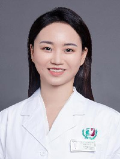

<!-- AUTO-GENERATED-BY: work/generate_obsidian_profiles.py -->

<!-- TEMPLATE: D:\workspace\信息收集整理\医生画像仓库\模板\医生画像模板.md -->

# 马芙蓉

## 基础信息

| 字段 | 内容 |
|---|---|
| 姓名 | 马芙蓉 |
| 医院 | 广州医科大学附属第三医院 |
| 科室 | 黄埔院区医学检验科 |
| 职称/身份 | 检验技师 |
| 来源链接 | [官网原文](https://www.gy3y.cn/ks/hp/yjbm/yxjyk/doctor_509.html) |
| 采集日期 | 2026-08-13 |

## 简介/擅长

从事临床医学检验工作5年，在临床免疫学与微生物学检验领域有较丰富的理论基础和实践经验，熟悉实验室质量管理体系，注重与临床沟通，致力于提升检验质量与效率，为患者诊疗提供精准可靠的实验室支持。

## 科研项目与成果

- 马芙蓉 医学硕士，检验技师，黄埔院区检验科免疫组组长兼试剂耗材管理员、广医三院检验科青年文明号副号长 研究方向/专业特长 从事临床医学检验工作5年，在临床免疫学与微生物学检验领域有较丰富的理论基础和实践经验，熟悉实验室质量管理体系，注重与临床沟通，致力于提升检验质量与效率，为患者诊疗提供精准可靠的实验室支持。
- 发表SCI论文8篇，主持或参与国家、省市级课题多项。

## 论文与学术产出

- 发表SCI论文8篇，主持或参与国家、省市级课题多项。

## 可包装亮点

- 马芙蓉 医学硕士，检验技师，黄埔院区检验科免疫组组长兼试剂耗材管理员、广医三院检验科青年文明号副号长 研究方向/专业特长 从事临床医学检验工作5年，在临床免疫学与微生物学检验领域有较丰富的理论基础和实践经验，熟悉实验室质量管理体系，注重与临床沟通，致力于提升检验质量与效率，为患者诊疗提供精准可靠的实验室支持。
- 发表SCI论文8篇，主持或参与国家、省市级课题多项。
- 学术兼职 广东省医院协会微生物与临床感染专业委员会委员 广东省卫生经济学会检验经济分会委员 广东省药学会临床微生物专委会委员 广东省健康科普促进会检验医学分会委员会委员 广州市医学会微生物学与免疫学分会委员会委员 广州市医学会检验医学分会青年学组组员

## 重点疾病/人群标签

- 慢性病：
- 肿瘤：
- 生殖疾病：
- 免疫/风湿：
- 术后恢复/康复：
- 疑难重症：

## 证据摘录

> 只摘录官网公开信息中的短句或关键字段，不复制大段原文。

- 官网身份字段：检验技师
- 官网简介/擅长：从事临床医学检验工作5年，在临床免疫学与微生物学检验领域有较丰富的理论基础和实践经验，熟悉实验室质量管理体系，注重与临床沟通，致力于提升检验质量与效率，为患者诊疗提供精准可靠的实验室支持。
- 官网亮眼经历线索：马芙蓉 医学硕士，检验技师，黄埔院区检验科免疫组组长兼试剂耗材管理员、广医三院检验科青年文明号副号长 研究方向/专业特长 从事临床医学检验工作5年，在临床免疫学与微生物学检验领域有较丰富的理论基础和实践经验，熟悉实验室质量管理体系，注重与临床沟通，致力于提升检验质量与效率，为患者诊疗提供精准可靠的实验室支持。 发表SCI论文8篇，主持或参与国家、省市级课题多项。 学术兼职 广东省医院协会微生物与临床感染专业委员会委员 广东省卫生经济学…
- 异常提示：职称/身份需人工复核
- 来源链接：https://www.gy3y.cn/ks/hp/yjbm/yxjyk/doctor_509.html

## BD 画像摘要

马芙蓉医生可作为广州医科大学附属第三医院黄埔院区医学检验科的基础医生资料入库。当前重点方向以总底表标签为准，官网未展示的信息保持空白。

## 合规边界

- 仅使用医院官网、官方公众号、官方小程序等公开渠道。
- 不采集私人电话、私人微信、家庭住址、患者隐私或非公开排班信息。
- 不写“保证治愈”“疗效第一”“包治疑难杂症”等无法由官网证明的表述。
