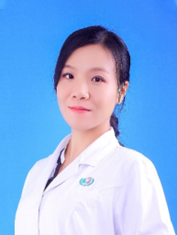

<!-- AUTO-GENERATED-BY: work/generate_obsidian_profiles.py -->

<!-- TEMPLATE: D:\workspace\信息收集整理\医生画像仓库\模板\医生画像模板.md -->

# 麦慧

## 基础信息

| 字段 | 内容 |
|---|---|
| 姓名 | 麦慧 |
| 医院 | 广州医科大学附属第三医院 |
| 科室 | 黄埔院区医学影像科/放射科 |
| 职称/身份 | 副主任医师 |
| 来源链接 | [官网原文](https://www.gy3y.cn/ks/hp/yjbm/fsk/doctor_393.html) |
| 采集日期 | 2026-08-13 |

## 简介/擅长

妇儿疾病的影像诊断

## 科研项目与成果

- 从事影像医学临床、教学及科研工作十余年；
- 主持及参与多项科研项目，在国内外学术期刊发表论文数十篇，研究方向为乳腺、妇产及儿科影像学。

## 论文与学术产出

- 主持及参与多项科研项目，在国内外学术期刊发表论文数十篇，研究方向为乳腺、妇产及儿科影像学。

## 可包装亮点

- 广州医科大学附属第三医院放射科副主任医师；
- 广东省妇幼保健协会放射专业委员会委员，广东省医学会放射医学分会乳腺学组委员，广州市医师协会放射科医师分会委员，广州市医学会放射学分会胸部学组组员。
- 主持及参与多项科研项目，在国内外学术期刊发表论文数十篇，研究方向为乳腺、妇产及儿科影像学。

## 重点疾病/人群标签

- 慢性病：
- 肿瘤：
- 生殖疾病：
- 免疫/风湿：
- 术后恢复/康复：
- 疑难重症：

## 证据摘录

> 只摘录官网公开信息中的短句或关键字段，不复制大段原文。

- 官网身份字段：副主任医师
- 官网简介/擅长：妇儿疾病的影像诊断
- 官网亮眼经历线索：广州医科大学附属第三医院放射科副主任医师； 广东省妇幼保健协会放射专业委员会委员，广东省医学会放射医学分会乳腺学组委员，广州市医师协会放射科医师分会委员，广州市医学会放射学分会胸部学组组员。 主持及参与多项科研项目，在国内外学术期刊发表论文数十篇，研究方向为乳腺、妇产及儿科影像学。
- 来源链接：https://www.gy3y.cn/ks/hp/yjbm/fsk/doctor_393.html

## BD 画像摘要

麦慧医生可作为广州医科大学附属第三医院黄埔院区医学影像科/放射科的基础医生资料入库。当前重点方向以总底表标签为准，官网未展示的信息保持空白。

## 合规边界

- 仅使用医院官网、官方公众号、官方小程序等公开渠道。
- 不采集私人电话、私人微信、家庭住址、患者隐私或非公开排班信息。
- 不写“保证治愈”“疗效第一”“包治疑难杂症”等无法由官网证明的表述。
