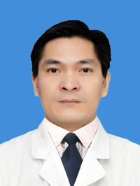

<!-- AUTO-GENERATED-BY: work/generate_obsidian_profiles.py -->

<!-- TEMPLATE: D:\workspace\信息收集整理\医生画像仓库\模板\医生画像模板.md -->

# 黄健威

## 基础信息

| 字段 | 内容 |
|---|---|
| 姓名 | 黄健威 |
| 医院 | 广州医科大学附属第三医院 |
| 科室 | 荔湾院区放射科、黄埔院区医学影像科/放射科 |
| 职称/身份 | 主任技师 |
| 来源链接 | [官网原文](https://www.gy3y.cn/ks/yjbm/fsk/doctor_285.html) |
| 采集日期 | 2026-08-13 |

## 简介/擅长

常规X线检查、CT扫描和MR胎儿成像技术。

## 教育与进修经历

- 详细介绍 黄健威，男，主任技师，硕士，毕业于广州医科大学。

## 可包装亮点

- 中华医学会影像技术分会教育专业组委员、青年委员、广东省医学会影像技术分会第二届委员、广州市影像技术分会第四常务委员。

## 重点疾病/人群标签

- 慢性病：
- 肿瘤：
- 生殖疾病：
- 免疫/风湿：
- 术后恢复/康复：
- 疑难重症：

## 证据摘录

> 只摘录官网公开信息中的短句或关键字段，不复制大段原文。

- 官网身份字段：主任技师
- 官网简介/擅长：常规X线检查、CT扫描和MR胎儿成像技术。
- 官网亮眼经历线索：中华医学会影像技术分会教育专业组委员、青年委员、广东省医学会影像技术分会第二届委员、广州市影像技术分会第四常务委员。
- 异常提示：职称/身份需人工复核
- 来源链接：https://www.gy3y.cn/ks/yjbm/fsk/doctor_285.html

## BD 画像摘要

黄健威医生可作为广州医科大学附属第三医院荔湾院区放射科、黄埔院区医学影像科/放射科的基础医生资料入库。当前重点方向以总底表标签为准，官网未展示的信息保持空白。

## 合规边界

- 仅使用医院官网、官方公众号、官方小程序等公开渠道。
- 不采集私人电话、私人微信、家庭住址、患者隐私或非公开排班信息。
- 不写“保证治愈”“疗效第一”“包治疑难杂症”等无法由官网证明的表述。
