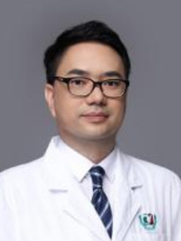

<!-- AUTO-GENERATED-BY: work/generate_obsidian_profiles.py -->

<!-- TEMPLATE: D:\workspace\信息收集整理\医生画像仓库\模板\医生画像模板.md -->

# 黄炯华

## 基础信息

| 字段 | 内容 |
|---|---|
| 姓名 | 黄炯华 |
| 医院 | 广州医科大学附属第三医院 |
| 科室 | 荔湾院区心血管内科 |
| 职称/身份 | 副教授、副主任医师 |
| 来源链接 | [官网原文](https://www.gy3y.cn/ks/nkxt/xxgnk/doctor_275.html) |
| 采集日期 | 2026-08-13 |

## 简介/擅长

主要从事心血管疾病的相关诊治工作，擅长下肢动脉硬化闭塞、冠心病、先天性心脏病、急性肺动脉栓塞、心脏瓣膜病及房颤左心耳封堵的微创介入治疗。

## 科研项目与成果

- 主持和参与国家级、省部级、市局级、校级及医院精英人才计划等多项科研项目。
- 近年来相关研究成果在Asian J Pharm Sci、Acta Pharmacol Sin、Int J Nanomedicine、Front Bioeng Biotechnol等权威SCI杂志发表。
- 获授权国内外专利9项，其中国内实用新型专利6项、发明专利2项，国外PCT专利1项。

## 论文与学术产出

- 近年来相关研究成果在Asian J Pharm Sci、Acta Pharmacol Sin、Int J Nanomedicine、Front Bioeng Biotechnol等权威SCI杂志发表。

## 可包装亮点

- 黄炯华 副主任医师、副教授，医学博士，硕士研究生导师 广州市卫生健康委员会优秀人才。
- 中国老年医学学会慢病防治与管理分会第一届委员会青年委员；
- 广东省胸部疾病学会心血管内科专业委员会委员；
- 广东省生物医学工程学会心血管内科工程分会委员；

## 重点疾病/人群标签

- 慢性病：冠心病、康复
- 肿瘤：
- 生殖疾病：
- 免疫/风湿：
- 术后恢复/康复：冠心病、康复
- 疑难重症：

## 证据摘录

> 只摘录官网公开信息中的短句或关键字段，不复制大段原文。

- 官网身份字段：副教授、副主任医师
- 官网简介/擅长：主要从事心血管疾病的相关诊治工作，擅长下肢动脉硬化闭塞、冠心病、先天性心脏病、急性肺动脉栓塞、心脏瓣膜病及房颤左心耳封堵的微创介入治疗。
- 官网亮眼经历线索：黄炯华 副主任医师、副教授，医学博士，硕士研究生导师 广州市卫生健康委员会优秀人才。 中国老年医学学会慢病防治与管理分会第一届委员会青年委员； 广东省胸部疾病学会心血管内科专业委员会委员； 广东省生物医学工程学会心血管内科工程分会委员；
- 来源链接：https://www.gy3y.cn/ks/nkxt/xxgnk/doctor_275.html

## BD 画像摘要

黄炯华医生可作为慢性病、术后恢复/康复方向的基础画像候选。后续 BD 使用应继续以官网来源和人工复核为准，不添加疗效承诺或无来源包装。

## 合规边界

- 仅使用医院官网、官方公众号、官方小程序等公开渠道。
- 不采集私人电话、私人微信、家庭住址、患者隐私或非公开排班信息。
- 不写“保证治愈”“疗效第一”“包治疑难杂症”等无法由官网证明的表述。
