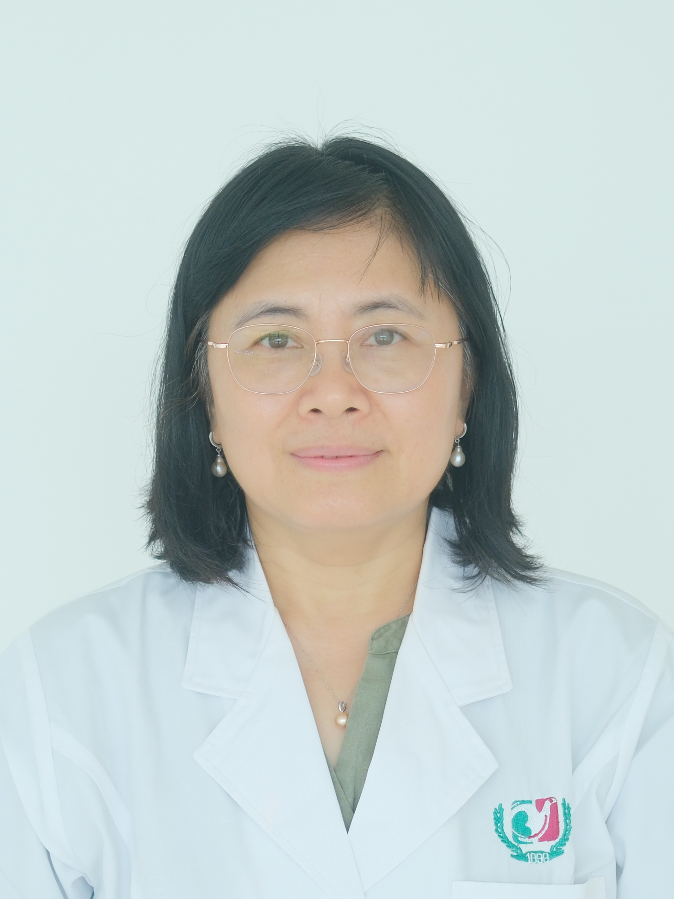

<!-- AUTO-GENERATED-BY: work/generate_obsidian_profiles.py -->

<!-- TEMPLATE: D:\workspace\信息收集整理\医生画像仓库\模板\医生画像模板.md -->

# 黎燕霞

## 基础信息

| 字段 | 内容 |
|---|---|
| 姓名 | 黎燕霞 |
| 医院 | 广州医科大学附属第三医院 |
| 科室 | 黄埔院区妇科 |
| 职称/身份 | 副主任医师 |
| 来源链接 | [官网原文](https://www.gy3y.cn/ks/hp/fck/fk/doctor_486.html) |
| 采集日期 | 2026-08-13 |

## 简介/擅长

子宫阴道脱垂、尿失禁、妇科肿瘤、月经异常及激素补充治疗、不孕症、子宫内膜异位症等诊治。

## 可包装亮点

- 曾任广东省医学会计划生育学分会委员、广东省医学会妇产科分会盘底学组秘书、广州市医学会妇产科分会委员、广东省医师协会妇产科分会妇科内分泌专业委员、广东省医师协会妇产科电生理医师分会委员。

## 重点疾病/人群标签

- 慢性病：
- 肿瘤：肿瘤、不孕、妇科内分泌、月经、功能障碍
- 生殖疾病：肿瘤、不孕、妇科内分泌、月经、功能障碍
- 免疫/风湿：
- 术后恢复/康复：肿瘤、不孕、妇科内分泌、月经、功能障碍
- 疑难重症：

## 证据摘录

> 只摘录官网公开信息中的短句或关键字段，不复制大段原文。

- 官网身份字段：副主任医师
- 官网简介/擅长：子宫阴道脱垂、尿失禁、妇科肿瘤、月经异常及激素补充治疗、不孕症、子宫内膜异位症等诊治。
- 官网亮眼经历线索：曾任广东省医学会计划生育学分会委员、广东省医学会妇产科分会盘底学组秘书、广州市医学会妇产科分会委员、广东省医师协会妇产科分会妇科内分泌专业委员、广东省医师协会妇产科电生理医师分会委员。
- 来源链接：https://www.gy3y.cn/ks/hp/fck/fk/doctor_486.html

## BD 画像摘要

黎燕霞医生可作为肿瘤、生殖疾病、术后恢复/康复方向的基础画像候选。后续 BD 使用应继续以官网来源和人工复核为准，不添加疗效承诺或无来源包装。

## 合规边界

- 仅使用医院官网、官方公众号、官方小程序等公开渠道。
- 不采集私人电话、私人微信、家庭住址、患者隐私或非公开排班信息。
- 不写“保证治愈”“疗效第一”“包治疑难杂症”等无法由官网证明的表述。
