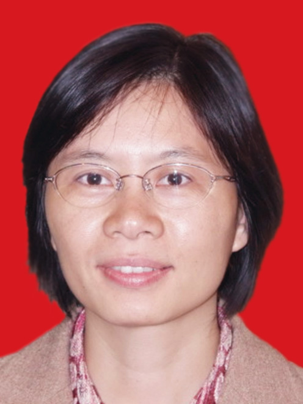

<!-- AUTO-GENERATED-BY: work/generate_obsidian_profiles.py -->

<!-- TEMPLATE: D:\workspace\信息收集整理\医生画像仓库\模板\医生画像模板.md -->

# 黎经兰

## 基础信息

| 字段 | 内容 |
|---|---|
| 姓名 | 黎经兰 |
| 医院 | 广州医科大学附属第三医院 |
| 科室 | 荔湾院区中医科 |
| 职称/身份 | 副主任中医师 |
| 来源链接 | [官网原文](https://www.gy3y.cn/ks/zyk/zyk1/doctor_157.html) |
| 采集日期 | 2026-08-13 |

## 简介/擅长

于使用中西医结合方法治疗呼吸道及心血管系统疾病。

## 教育与进修经历

- 从事医疗临床工作三十年，积累了丰富的临床实践经验，毕业后一直从事中医内科病治疗，尤擅长于使用中西医结合方法治疗呼吸道及心血管系统疾病，并在省级杂志上发表论文多篇，为中国中医药学会广州分会理事。

## 论文与学术产出

- 从事医疗临床工作三十年，积累了丰富的临床实践经验，毕业后一直从事中医内科病治疗，尤擅长于使用中西医结合方法治疗呼吸道及心血管系统疾病，并在省级杂志上发表论文多篇，为中国中医药学会广州分会理事。

## 可包装亮点

- 从事医疗临床工作三十年，积累了丰富的临床实践经验，毕业后一直从事中医内科病治疗，尤擅长于使用中西医结合方法治疗呼吸道及心血管系统疾病，并在省级杂志上发表论文多篇，为中国中医药学会广州分会理事。

## 重点疾病/人群标签

- 慢性病：
- 肿瘤：
- 生殖疾病：
- 免疫/风湿：
- 术后恢复/康复：
- 疑难重症：

## 证据摘录

> 只摘录官网公开信息中的短句或关键字段，不复制大段原文。

- 官网身份字段：副主任中医师
- 官网简介/擅长：于使用中西医结合方法治疗呼吸道及心血管系统疾病。
- 官网亮眼经历线索：从事医疗临床工作三十年，积累了丰富的临床实践经验，毕业后一直从事中医内科病治疗，尤擅长于使用中西医结合方法治疗呼吸道及心血管系统疾病，并在省级杂志上发表论文多篇，为中国中医药学会广州分会理事。
- 来源链接：https://www.gy3y.cn/ks/zyk/zyk1/doctor_157.html

## BD 画像摘要

黎经兰医生可作为广州医科大学附属第三医院荔湾院区中医科的基础医生资料入库。当前重点方向以总底表标签为准，官网未展示的信息保持空白。

## 合规边界

- 仅使用医院官网、官方公众号、官方小程序等公开渠道。
- 不采集私人电话、私人微信、家庭住址、患者隐私或非公开排班信息。
- 不写“保证治愈”“疗效第一”“包治疑难杂症”等无法由官网证明的表述。
