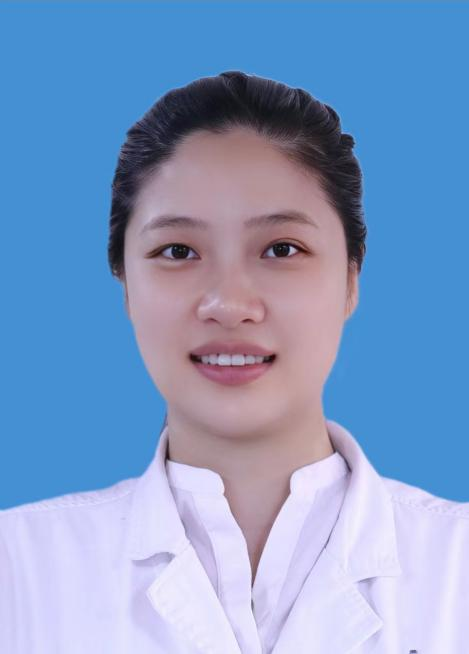

<!-- AUTO-GENERATED-BY: work/generate_obsidian_profiles.py -->

<!-- TEMPLATE: D:\workspace\信息收集整理\医生画像仓库\模板\医生画像模板.md -->

# 何婷玉

## 基础信息

| 字段 | 内容 |
|---|---|
| 姓名 | 何婷玉 |
| 医院 | 广州医科大学附属脑科医院 |
| 科室 | 物质依赖科 |
| 职称/身份 | 主治医师 |
| 来源链接 | [官网原文](https://www.gzbrain.cn/myzj/info_itemid_83231.html) |
| 采集日期 | 2026-08-13 |

## 简介/擅长

酒精成瘾、烟草成瘾及其他精神活性物质滥用和依赖问题；网络游戏成瘾等行为成瘾问题；精神分裂症、情感障碍、睡眠障碍、焦虑抑郁等问题。

## 可包装亮点

- 亚洲药物滥用研究学会会员；
- 亚洲药物成瘾心理治疗专业委员会委员；
- 中国药物滥用防治协会烟草依赖与戒烟分会委员。

## 重点疾病/人群标签

- 慢性病：
- 肿瘤：
- 生殖疾病：
- 免疫/风湿：
- 术后恢复/康复：
- 疑难重症：

## 证据摘录

> 只摘录官网公开信息中的短句或关键字段，不复制大段原文。

- 官网身份字段：主治医师
- 官网简介/擅长：酒精成瘾、烟草成瘾及其他精神活性物质滥用和依赖问题；网络游戏成瘾等行为成瘾问题；精神分裂症、情感障碍、睡眠障碍、焦虑抑郁等问题。
- 官网亮眼经历线索：亚洲药物滥用研究学会会员； 亚洲药物成瘾心理治疗专业委员会委员； 中国药物滥用防治协会烟草依赖与戒烟分会委员。
- 来源链接：https://www.gzbrain.cn/myzj/info_itemid_83231.html

## BD 画像摘要

何婷玉医生可作为广州医科大学附属脑科医院物质依赖科的基础医生资料入库。当前重点方向以总底表标签为准，官网未展示的信息保持空白。

## 合规边界

- 仅使用医院官网、官方公众号、官方小程序等公开渠道。
- 不采集私人电话、私人微信、家庭住址、患者隐私或非公开排班信息。
- 不写“保证治愈”“疗效第一”“包治疑难杂症”等无法由官网证明的表述。
