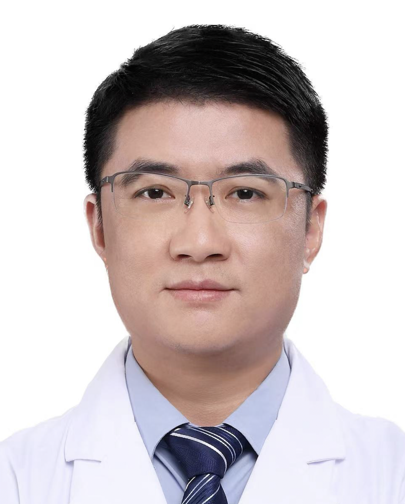

<!-- AUTO-GENERATED-BY: work/generate_obsidian_profiles.py -->

<!-- TEMPLATE: D:\workspace\信息收集整理\医生画像仓库\模板\医生画像模板.md -->

# 刘亚平

## 基础信息

| 字段 | 内容 |
|---|---|
| 姓名 | 刘亚平 |
| 医院 | 广州医科大学附属脑科医院 |
| 科室 | 睡眠与节律医学中心 |
| 职称/身份 | 教授 |
| 来源链接 | [官网原文](https://www.gzbrain.cn/myzj/info_itemid_76801.html) |
| 采集日期 | 2026-08-13 |

## 简介/擅长

各类睡眠障碍的诊治

## 科研项目与成果

- 主持国家自然科学基金以及香港政府研究基金等项目7项，发表SCI论文30余篇，包括临床神经科学知名期刊如Ann Neurol、Neurology等，为Sleep Med Rev等20余本期刊审稿专家。

## 论文与学术产出

- 主持国家自然科学基金以及香港政府研究基金等项目7项，发表SCI论文30余篇，包括临床神经科学知名期刊如Ann Neurol、Neurology等，为Sleep Med Rev等20余本期刊审稿专家。

## 可包装亮点

- 医学博士，广东省高层次人才（省级特聘教授），博士生导师，睡眠与节律医学中心主任，香港中文大学客座助理教授。
- 主持国家自然科学基金以及香港政府研究基金等项目7项，发表SCI论文30余篇，包括临床神经科学知名期刊如Ann Neurol、Neurology等，为Sleep Med Rev等20余本期刊审稿专家。
- 任中国睡眠研究会青委会常委以及广东省医学会睡眠医学分会副主委。
- 获世界睡眠医学会青年科学家奖。

## 重点疾病/人群标签

- 慢性病：
- 肿瘤：
- 生殖疾病：
- 免疫/风湿：
- 术后恢复/康复：
- 疑难重症：

## 证据摘录

> 只摘录官网公开信息中的短句或关键字段，不复制大段原文。

- 官网身份字段：教授
- 官网简介/擅长：各类睡眠障碍的诊治
- 官网亮眼经历线索：医学博士，广东省高层次人才（省级特聘教授），博士生导师，睡眠与节律医学中心主任，香港中文大学客座助理教授。 主持国家自然科学基金以及香港政府研究基金等项目7项，发表SCI论文30余篇，包括临床神经科学知名期刊如Ann Neurol、Neurology等，为Sleep Med Rev等20余本期刊审稿专家。 任中国睡眠研究会青委会常委以及广东省医学会睡眠医学分会副主委。 获世界睡眠医学会青年科学家奖。
- 来源链接：https://www.gzbrain.cn/myzj/info_itemid_76801.html

## BD 画像摘要

刘亚平医生可作为广州医科大学附属脑科医院睡眠与节律医学中心的基础医生资料入库。当前重点方向以总底表标签为准，官网未展示的信息保持空白。

## 合规边界

- 仅使用医院官网、官方公众号、官方小程序等公开渠道。
- 不采集私人电话、私人微信、家庭住址、患者隐私或非公开排班信息。
- 不写“保证治愈”“疗效第一”“包治疑难杂症”等无法由官网证明的表述。
