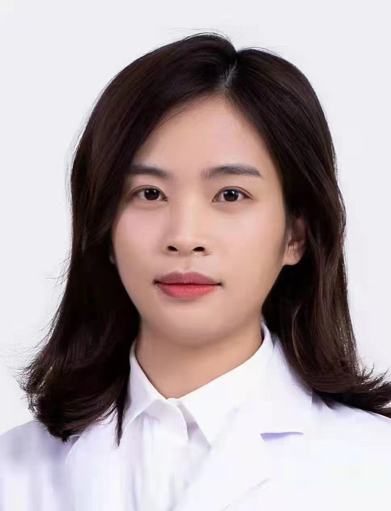

<!-- AUTO-GENERATED-BY: work/generate_obsidian_profiles.py -->

<!-- TEMPLATE: D:\workspace\信息收集整理\医生画像仓库\模板\医生画像模板.md -->

# 周素妙

## 基础信息

| 字段 | 内容 |
|---|---|
| 姓名 | 周素妙 |
| 医院 | 广州医科大学附属脑科医院 |
| 科室 | 中西医结合科 |
| 职称/身份 | 主治医师 |
| 来源链接 | [官网原文](https://www.gzbrain.cn/myzj/info_itemid_96281.html) |
| 采集日期 | 2026-08-13 |

## 简介/擅长

抑郁障碍、双相情感障碍、失眠、焦虑、精神分裂症等疾病的诊疗，对精神疾病早期识别的氧化应激标志物有较丰富的经验。

## 科研项目与成果

- 主持省级课题一项，作为团队骨干参与多项国家级、省级及市级科研项目，发表国内外医学学术论文 30 余篇。

## 论文与学术产出

- 主持省级课题一项，作为团队骨干参与多项国家级、省级及市级科研项目，发表国内外医学学术论文 30 余篇。

## 可包装亮点

- 现任广东省中医药学会老年健康与慢病管理专业委员、广东省心理卫生协会重性心理障碍专业委员会委员、广州市医师协会精神医学分会委员、广州市医学会精神医学分会委员、。
- 主持省级课题一项，作为团队骨干参与多项国家级、省级及市级科研项目，发表国内外医学学术论文 30 余篇。
- 荣获“本科优秀教师”和“优秀科技人才”等称号。

## 重点疾病/人群标签

- 慢性病：
- 肿瘤：
- 生殖疾病：
- 免疫/风湿：
- 术后恢复/康复：
- 疑难重症：

## 证据摘录

> 只摘录官网公开信息中的短句或关键字段，不复制大段原文。

- 官网身份字段：主治医师
- 官网简介/擅长：抑郁障碍、双相情感障碍、失眠、焦虑、精神分裂症等疾病的诊疗，对精神疾病早期识别的氧化应激标志物有较丰富的经验。
- 官网亮眼经历线索：现任广东省中医药学会老年健康与慢病管理专业委员、广东省心理卫生协会重性心理障碍专业委员会委员、广州市医师协会精神医学分会委员、广州市医学会精神医学分会委员、。 主持省级课题一项，作为团队骨干参与多项国家级、省级及市级科研项目，发表国内外医学学术论文 30 余篇。 荣获“本科优秀教师”和“优秀科技人才”等称号。
- 来源链接：https://www.gzbrain.cn/myzj/info_itemid_96281.html

## BD 画像摘要

周素妙医生可作为广州医科大学附属脑科医院中西医结合科的基础医生资料入库。当前重点方向以总底表标签为准，官网未展示的信息保持空白。

## 合规边界

- 仅使用医院官网、官方公众号、官方小程序等公开渠道。
- 不采集私人电话、私人微信、家庭住址、患者隐私或非公开排班信息。
- 不写“保证治愈”“疗效第一”“包治疑难杂症”等无法由官网证明的表述。
