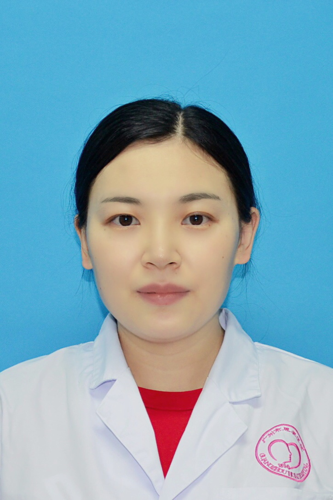

<!-- AUTO-GENERATED-BY: work/generate_obsidian_profiles.py -->

<!-- TEMPLATE: D:\workspace\信息收集整理\医生画像仓库\模板\医生画像模板.md -->

# 崔娟

## 基础信息

| 字段 | 内容 |
|---|---|
| 姓名 | 崔娟 |
| 医院 | 广州医科大学附属脑科医院 |
| 科室 | 中医神志病 |
| 职称/身份 | 主治中医师 |
| 来源链接 | [官网原文](https://www.gzbrain.cn/myzj/info_itemid_14140.html) |
| 采集日期 | 2026-08-13 |

## 简介/擅长

中西医结合治疗焦虑症、睡眠障碍、抑郁症、精神分裂症等精神疾病

## 教育与进修经历

- 中医学硕士，毕业于广州中医药大学中西医结合临床专业。
- 毕业后从事中西医结合治疗精神疾病的临床及科研工作， 主持广州市中医药和中西医结合科技项目课题 1项，发表论文多篇。

## 科研项目与成果

- 毕业后从事中西医结合治疗精神疾病的临床及科研工作， 主持广州市中医药和中西医结合科技项目课题 1项，发表论文多篇。

## 论文与学术产出

- 毕业后从事中西医结合治疗精神疾病的临床及科研工作， 主持广州市中医药和中西医结合科技项目课题 1项，发表论文多篇。

## 可包装亮点

- 毕业后从事中西医结合治疗精神疾病的临床及科研工作， 主持广州市中医药和中西医结合科技项目课题 1项，发表论文多篇。

## 重点疾病/人群标签

- 慢性病：
- 肿瘤：
- 生殖疾病：
- 免疫/风湿：
- 术后恢复/康复：
- 疑难重症：

## 证据摘录

> 只摘录官网公开信息中的短句或关键字段，不复制大段原文。

- 官网身份字段：主治中医师
- 官网简介/擅长：中西医结合治疗焦虑症、睡眠障碍、抑郁症、精神分裂症等精神疾病
- 官网亮眼经历线索：毕业后从事中西医结合治疗精神疾病的临床及科研工作， 主持广州市中医药和中西医结合科技项目课题 1项，发表论文多篇。
- 来源链接：https://www.gzbrain.cn/myzj/info_itemid_14140.html

## BD 画像摘要

崔娟医生可作为广州医科大学附属脑科医院中医神志病的基础医生资料入库。当前重点方向以总底表标签为准，官网未展示的信息保持空白。

## 合规边界

- 仅使用医院官网、官方公众号、官方小程序等公开渠道。
- 不采集私人电话、私人微信、家庭住址、患者隐私或非公开排班信息。
- 不写“保证治愈”“疗效第一”“包治疑难杂症”等无法由官网证明的表述。
