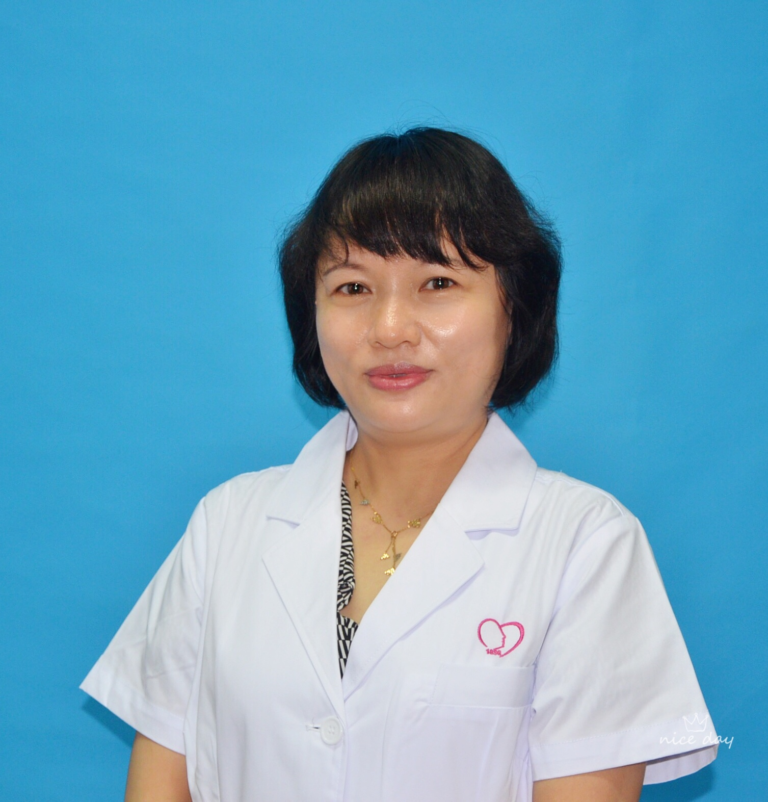

<!-- AUTO-GENERATED-BY: work/generate_obsidian_profiles.py -->

<!-- TEMPLATE: D:\workspace\信息收集整理\医生画像仓库\模板\医生画像模板.md -->

# 张双春

## 基础信息

| 字段 | 内容 |
|---|---|
| 姓名 | 张双春 |
| 医院 | 广州医科大学附属脑科医院 |
| 科室 | 临床心理科 |
| 职称/身份 | 心理治疗师 |
| 来源链接 | [官网原文](https://www.gzbrain.cn/myzj/info_itemid_11791.html) |
| 采集日期 | 2026-08-13 |

## 简介/擅长

儿童青少年情绪障碍、多动和抽动障碍、厌学和考试焦虑、亲子关系和人际困扰、婚姻和家庭问题的沙盘治疗、个体治疗和团体治疗。

## 教育与进修经历

- 目前在广州市惠爱医院临床心理科从事心理治疗工作，曾参加沙盘游戏治疗、精神分析、认知行为治疗、自体心理学、隐喻等疗法系列培训学习。

## 可包装亮点

- 儿童青少年情绪障碍、多动和抽动障碍、厌学和考试焦虑、亲子关系和人际困扰、婚姻和家庭问题的沙盘治疗、个体治疗和团体治疗。

## 重点疾病/人群标签

- 慢性病：
- 肿瘤：
- 生殖疾病：
- 免疫/风湿：
- 术后恢复/康复：
- 疑难重症：

## 证据摘录

> 只摘录官网公开信息中的短句或关键字段，不复制大段原文。

- 官网身份字段：心理治疗师
- 官网简介/擅长：儿童青少年情绪障碍、多动和抽动障碍、厌学和考试焦虑、亲子关系和人际困扰、婚姻和家庭问题的沙盘治疗、个体治疗和团体治疗。
- 异常提示：职称/身份需人工复核
- 来源链接：https://www.gzbrain.cn/myzj/info_itemid_11791.html

## BD 画像摘要

张双春医生可作为广州医科大学附属脑科医院临床心理科的基础医生资料入库。当前重点方向以总底表标签为准，官网未展示的信息保持空白。

## 合规边界

- 仅使用医院官网、官方公众号、官方小程序等公开渠道。
- 不采集私人电话、私人微信、家庭住址、患者隐私或非公开排班信息。
- 不写“保证治愈”“疗效第一”“包治疑难杂症”等无法由官网证明的表述。
