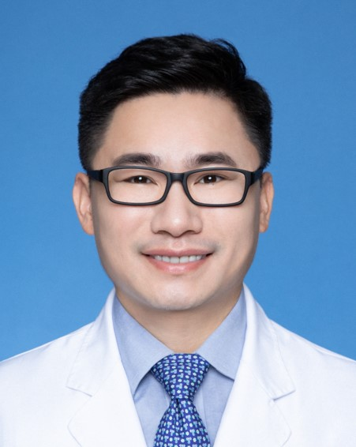

<!-- AUTO-GENERATED-BY: work/generate_obsidian_profiles.py -->

<!-- TEMPLATE: D:\workspace\信息收集整理\医生画像仓库\模板\医生画像模板.md -->

# 张继辉

## 基础信息

| 字段 | 内容 |
|---|---|
| 姓名 | 张继辉 |
| 医院 | 广州医科大学附属脑科医院 |
| 科室 | 睡眠与节律医学中心 |
| 职称/身份 | 研究员（正高） |
| 来源链接 | [官网原文](https://www.gzbrain.cn/myzj/info_itemid_49356.html) |
| 采集日期 | 2026-08-13 |

## 简介/擅长

睡眠障碍在精神和躯体疾病中的作用及机制，失眠、梦游、打鼾、呼吸

## 科研项目与成果

- 先后主持9项国家级基金，包括5项香港政府基金（4项医疗卫生基金和1项RGC基金）、3项国家自然科学基金和1项国家重点研发计划课题。
- 研发了数字化失眠评估和行为治疗平台，获得软件著作版权2项，并获批2023年广州临床特色技术项目。
- 获批2023年度广州市市校（院）企联合资助项目。
- 参与编著Paediatric Sleep Disorders、《睡眠医学名词》、《中国睡眠医学中心标准化建设指南》、《中国失眠障碍诊断和治疗指南》、《中国失眠障碍综合防治指南》和《睡眠健康管理手册》，相关研究成果被写入多本国内外教材及临床指南，包括“十二五”普通高等教育本科国家级规划教材《神经病学》（人民卫生出版社，第7版）、国际睡眠障碍诊断标准（第3版，ICSD-3）、国际知名睡眠医学教材 Principles and Practice of Sleep Medicine（第6版）。

## 论文与学术产出

- 研发了数字化失眠评估和行为治疗平台，获得软件著作版权2项，并获批2023年广州临床特色技术项目。
- 近5年以独立或最后通讯身份在Eur Heart J (IF=35.855)、Nature Communications (IF=17.694)、NPJ Digital Medicine (IF=15.357) 、Ann Neurol (IF=11.274)、JACC Heart Fail (IF=12.544)等期刊发表近20篇SCI论文。

## 可包装亮点

- 博士生导师，香港中文大学内科科学博士。
- 中国睡眠研究会青年工作委员会第三届主任委员，海峡两岸医药卫生交流协会睡眠医学专业委员会副主任委员。
- 先后主持9项国家级基金，包括5项香港政府基金（4项医疗卫生基金和1项RGC基金）、3项国家自然科学基金和1项国家重点研发计划课题。
- 近5年以独立或最后通讯身份在Eur Heart J (IF=35.855)、Nature Communications (IF=17.694)、NPJ Digital Medicine (IF=15.357) 、Ann Neurol (IF=11.274)、JACC Heart Fail (IF=12.544)等期刊发表近20篇SCI论文。

## 重点疾病/人群标签

- 慢性病：
- 肿瘤：
- 生殖疾病：
- 免疫/风湿：
- 术后恢复/康复：
- 疑难重症：

## 证据摘录

> 只摘录官网公开信息中的短句或关键字段，不复制大段原文。

- 官网身份字段：研究员（正高）
- 官网简介/擅长：睡眠障碍在精神和躯体疾病中的作用及机制，失眠、梦游、打鼾、呼吸
- 官网亮眼经历线索：博士生导师，香港中文大学内科科学博士。 中国睡眠研究会青年工作委员会第三届主任委员，海峡两岸医药卫生交流协会睡眠医学专业委员会副主任委员。 先后主持9项国家级基金，包括5项香港政府基金（4项医疗卫生基金和1项RGC基金）、3项国家自然科学基金和1项国家重点研发计划课题。 近5年以独立或最后通讯身份在Eur Heart J (IF=35.855)、Nature Communications (IF=17.694)、NPJ Digital…
- 来源链接：https://www.gzbrain.cn/myzj/info_itemid_49356.html

## BD 画像摘要

张继辉医生可作为广州医科大学附属脑科医院睡眠与节律医学中心的基础医生资料入库。当前重点方向以总底表标签为准，官网未展示的信息保持空白。

## 合规边界

- 仅使用医院官网、官方公众号、官方小程序等公开渠道。
- 不采集私人电话、私人微信、家庭住址、患者隐私或非公开排班信息。
- 不写“保证治愈”“疗效第一”“包治疑难杂症”等无法由官网证明的表述。
