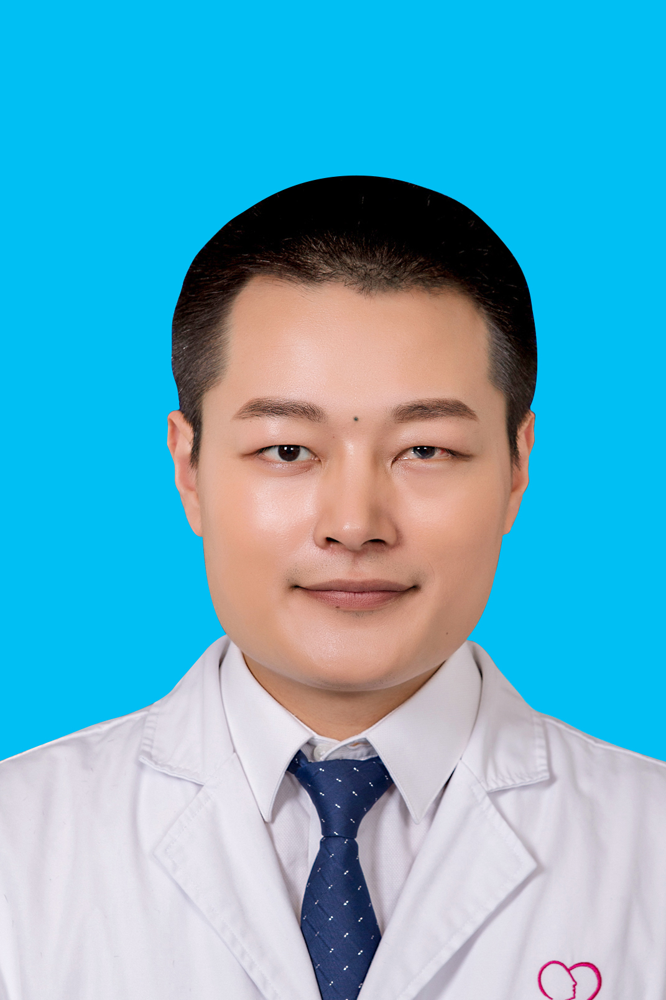

<!-- AUTO-GENERATED-BY: work/generate_obsidian_profiles.py -->

<!-- TEMPLATE: D:\workspace\信息收集整理\医生画像仓库\模板\医生画像模板.md -->

# 徐琰

## 基础信息

| 字段 | 内容 |
|---|---|
| 姓名 | 徐琰 |
| 医院 | 广州医科大学附属脑科医院 |
| 科室 | 中医针灸学 |
| 职称/身份 | 主治医师 |
| 来源链接 | [官网原文](https://www.gzbrain.cn/myzj/info_itemid_478.html) |
| 采集日期 | 2026-08-13 |

## 简介/擅长

运用传统中医经典《黄帝内经》《伤寒论》辨证体系，针灸中药结合治疗抑郁症、双相障碍、精神分裂症、焦虑症、睡眠障碍、常见内科疾病以及颈肩腰腿痛等。

## 教育与进修经历

- 医学硕士，中医师，毕业于广州中医药大学。

## 科研项目与成果

- 参与建设国家中医药管理局 “十二五”重点专科等项目建设，参与多项国家省部级课题，发表论文数篇。

## 论文与学术产出

- 参与建设国家中医药管理局 “十二五”重点专科等项目建设，参与多项国家省部级课题，发表论文数篇。

## 可包装亮点

- 参与建设国家中医药管理局 “十二五”重点专科等项目建设，参与多项国家省部级课题，发表论文数篇。

## 重点疾病/人群标签

- 慢性病：
- 肿瘤：
- 生殖疾病：
- 免疫/风湿：
- 术后恢复/康复：
- 疑难重症：

## 证据摘录

> 只摘录官网公开信息中的短句或关键字段，不复制大段原文。

- 官网身份字段：主治医师
- 官网简介/擅长：运用传统中医经典《黄帝内经》《伤寒论》辨证体系，针灸中药结合治疗抑郁症、双相障碍、精神分裂症、焦虑症、睡眠障碍、常见内科疾病以及颈肩腰腿痛等。
- 官网亮眼经历线索：参与建设国家中医药管理局 “十二五”重点专科等项目建设，参与多项国家省部级课题，发表论文数篇。
- 来源链接：https://www.gzbrain.cn/myzj/info_itemid_478.html

## BD 画像摘要

徐琰医生可作为广州医科大学附属脑科医院中医针灸学的基础医生资料入库。当前重点方向以总底表标签为准，官网未展示的信息保持空白。

## 合规边界

- 仅使用医院官网、官方公众号、官方小程序等公开渠道。
- 不采集私人电话、私人微信、家庭住址、患者隐私或非公开排班信息。
- 不写“保证治愈”“疗效第一”“包治疑难杂症”等无法由官网证明的表述。
