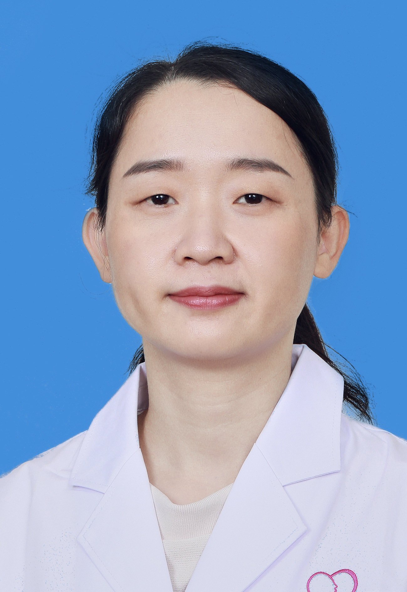

<!-- AUTO-GENERATED-BY: work/generate_obsidian_profiles.py -->

<!-- TEMPLATE: D:\workspace\信息收集整理\医生画像仓库\模板\医生画像模板.md -->

# 方雅秀

## 基础信息

| 字段 | 内容 |
|---|---|
| 姓名 | 方雅秀 |
| 医院 | 广州医科大学附属脑科医院 |
| 科室 | 神经内科 |
| 职称/身份 | 主任医师 |
| 来源链接 | [官网原文](https://www.gzbrain.cn/myzj/info_itemid_537.html) |
| 采集日期 | 2026-08-13 |

## 简介/擅长

各种神经精神共病如痴呆、脑炎、癫痫、帕金森病、抽动症以及头痛、头晕、失眠、焦虑症、抑郁症等。

## 科研项目与成果

- 曾参与国家自然基金项目 1项，作为第三完成人获“福建省科学技术奖二等奖”和“福建医学科技奖一等奖”2项。

## 论文与学术产出

- 主要从事神经退行性疾病、认知障碍及神经感染与免疫性疾病的研究工作，发表中英文论文多篇 。

## 可包装亮点

- 医学 博士， 主任医师， 硕士生导师 ， 精神神经科学病房病区主任，羊城好医生，任 广东省医疗行业协会神经内科管理分会常务委员、广东省医师协会第五届神经内科医师分会委员、广东省医师协会神经病学分会第十届委员会神经免疫学组成员、广东省医学会脑血管病学分会第一届委员会青年委员会委员 等多项学术任职。
- 主要从事神经退行性疾病、认知障碍及神经感染与免疫性疾病的研究工作，发表中英文论文多篇 。
- 曾参与国家自然基金项目 1项，作为第三完成人获“福建省科学技术奖二等奖”和“福建医学科技奖一等奖”2项。

## 重点疾病/人群标签

- 慢性病：
- 肿瘤：
- 生殖疾病：
- 免疫/风湿：免疫、感染
- 术后恢复/康复：
- 疑难重症：

## 证据摘录

> 只摘录官网公开信息中的短句或关键字段，不复制大段原文。

- 官网身份字段：主任医师
- 官网简介/擅长：各种神经精神共病如痴呆、脑炎、癫痫、帕金森病、抽动症以及头痛、头晕、失眠、焦虑症、抑郁症等。
- 官网亮眼经历线索：医学 博士， 主任医师， 硕士生导师 ， 精神神经科学病房病区主任，羊城好医生，任 广东省医疗行业协会神经内科管理分会常务委员、广东省医师协会第五届神经内科医师分会委员、广东省医师协会神经病学分会第十届委员会神经免疫学组成员、广东省医学会脑血管病学分会第一届委员会青年委员会委员 等多项学术任职。 主要从事神经退行性疾病、认知障碍及神经感染与免疫性疾病的研究工作，发表中英文论文多篇 。 曾参与国家自然基金项目 1项，作为第三完成人获“福…
- 来源链接：https://www.gzbrain.cn/myzj/info_itemid_537.html

## BD 画像摘要

方雅秀医生可作为免疫/风湿/感染方向的基础画像候选。后续 BD 使用应继续以官网来源和人工复核为准，不添加疗效承诺或无来源包装。

## 合规边界

- 仅使用医院官网、官方公众号、官方小程序等公开渠道。
- 不采集私人电话、私人微信、家庭住址、患者隐私或非公开排班信息。
- 不写“保证治愈”“疗效第一”“包治疑难杂症”等无法由官网证明的表述。
