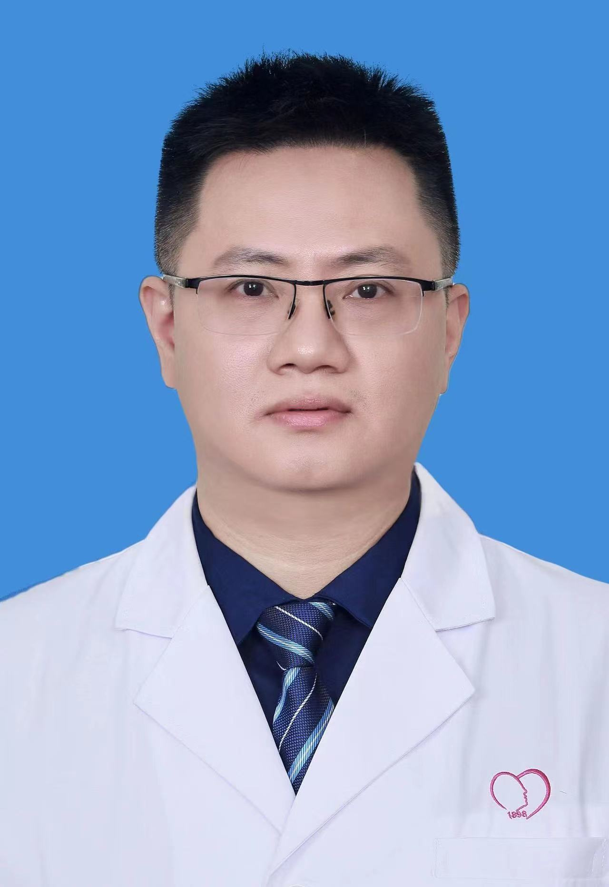

<!-- AUTO-GENERATED-BY: work/generate_obsidian_profiles.py -->

<!-- TEMPLATE: D:\workspace\信息收集整理\医生画像仓库\模板\医生画像模板.md -->

# 李则挚

## 基础信息

| 字段 | 内容 |
|---|---|
| 姓名 | 李则挚 |
| 医院 | 广州医科大学附属脑科医院 |
| 科室 | 成人精神科 |
| 职称/身份 | 副主任医师 |
| 来源链接 | [官网原文](https://www.gzbrain.cn/myzj/info_itemid_48466.html) |
| 采集日期 | 2026-08-13 |

## 简介/擅长

抑郁症、双相障碍、精神分裂症、焦虑症、强迫症、睡眠障碍等各类精神心理障碍的诊疗

## 教育与进修经历

- 美国 NIH 博士后、研究员。
- 广州市精神卫生学院教授、博导、博士后导师。

## 科研项目与成果

- 主持国家自然科学基金项目等十余项项目，并牵头多项国际研究。

## 论文与学术产出

- 以第一作者或通讯作者发表 SCI 论文 62 篇 , 总影响因子 402.6 分，十分以上论文 8 篇。
- 多家 SCI 期刊的编辑及 20 余家 SCI 杂志的审稿人。

## 可包装亮点

- 李则挚，男，科主任，研究员，副主任医师。
- 美国 NIH 博士后、研究员。
- 主持国家自然科学基金项目等十余项项目，并牵头多项国际研究。
- 以第一作者或通讯作者发表 SCI 论文 62 篇 , 总影响因子 402.6 分，十分以上论文 8 篇。

## 重点疾病/人群标签

- 慢性病：
- 肿瘤：
- 生殖疾病：
- 免疫/风湿：
- 术后恢复/康复：
- 疑难重症：

## 证据摘录

> 只摘录官网公开信息中的短句或关键字段，不复制大段原文。

- 官网身份字段：副主任医师
- 官网简介/擅长：抑郁症、双相障碍、精神分裂症、焦虑症、强迫症、睡眠障碍等各类精神心理障碍的诊疗
- 官网亮眼经历线索：李则挚，男，科主任，研究员，副主任医师。 美国 NIH 博士后、研究员。 主持国家自然科学基金项目等十余项项目，并牵头多项国际研究。 以第一作者或通讯作者发表 SCI 论文 62 篇 , 总影响因子 402.6 分，十分以上论文 8 篇。
- 来源链接：https://www.gzbrain.cn/myzj/info_itemid_48466.html

## BD 画像摘要

李则挚医生可作为广州医科大学附属脑科医院成人精神科的基础医生资料入库。当前重点方向以总底表标签为准，官网未展示的信息保持空白。

## 合规边界

- 仅使用医院官网、官方公众号、官方小程序等公开渠道。
- 不采集私人电话、私人微信、家庭住址、患者隐私或非公开排班信息。
- 不写“保证治愈”“疗效第一”“包治疑难杂症”等无法由官网证明的表述。
