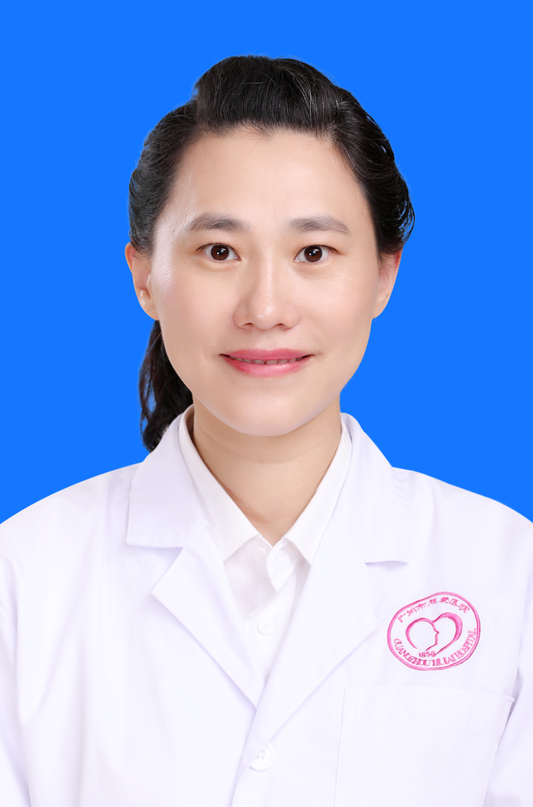

<!-- AUTO-GENERATED-BY: work/generate_obsidian_profiles.py -->

<!-- TEMPLATE: D:\workspace\信息收集整理\医生画像仓库\模板\医生画像模板.md -->

# 李强

## 基础信息

| 字段 | 内容 |
|---|---|
| 姓名 | 李强 |
| 医院 | 广州医科大学附属脑科医院 |
| 科室 | 心身医学科 |
| 职称/身份 | 主治医师 |
| 来源链接 | [官网原文](https://www.gzbrain.cn/myzj/info_itemid_894.html) |
| 采集日期 | 2026-08-13 |

## 简介/擅长

精神科常见疾病的诊疗，尤其擅长焦虑障碍、抑郁障碍、强迫障碍、躯体形式障碍、慢性躯体疼痛、疑病症、神经衰弱、睡眠障碍、儿童青少年情绪和行为障碍、伴有情绪障碍的各类躯体疾病的诊断及治疗。

## 教育与进修经历

- 李强，女，主治医师，硕士研究生，毕业于哈尔滨医科大学。
- 2006年毕业后工作于哈尔滨医科大学附属第一医院精神科，从事综合医院精神心理工作8年，具有扎实的理论知识基础及丰富的临床实践经验。
- 曾参加第三届医患沟通技能与医务人员自我成长（巴林特小组）培训、情绪管理心理技巧培训、家庭治疗心理技术培训以及心身医学与心理治疗连续培训项目，运用心身一体的诊疗模式为患者提供整体医疗服务模式。

## 科研项目与成果

- 曾参加第三届医患沟通技能与医务人员自我成长（巴林特小组）培训、情绪管理心理技巧培训、家庭治疗心理技术培训以及心身医学与心理治疗连续培训项目，运用心身一体的诊疗模式为患者提供整体医疗服务模式。

## 可包装亮点

- 精神科常见疾病的诊疗，尤其擅长焦虑障碍、抑郁障碍、强迫障碍、躯体形式障碍、慢性躯体疼痛、疑病症、神经衰弱、睡眠障碍、儿童青少年情绪和行为障碍、伴有情绪障碍的各类躯体疾病的诊断及治疗。

## 重点疾病/人群标签

- 慢性病：高血压、冠心病、慢性、疼痛
- 肿瘤：
- 生殖疾病：
- 免疫/风湿：
- 术后恢复/康复：高血压、冠心病、慢性、疼痛
- 疑难重症：

## 证据摘录

> 只摘录官网公开信息中的短句或关键字段，不复制大段原文。

- 官网身份字段：主治医师
- 官网简介/擅长：精神科常见疾病的诊疗，尤其擅长焦虑障碍、抑郁障碍、强迫障碍、躯体形式障碍、慢性躯体疼痛、疑病症、神经衰弱、睡眠障碍、儿童青少年情绪和行为障碍、伴有情绪障碍的各类躯体疾病的诊断及治疗。
- 来源链接：https://www.gzbrain.cn/myzj/info_itemid_894.html

## BD 画像摘要

李强医生可作为慢性病、术后恢复/康复方向的基础画像候选。后续 BD 使用应继续以官网来源和人工复核为准，不添加疗效承诺或无来源包装。

## 合规边界

- 仅使用医院官网、官方公众号、官方小程序等公开渠道。
- 不采集私人电话、私人微信、家庭住址、患者隐私或非公开排班信息。
- 不写“保证治愈”“疗效第一”“包治疑难杂症”等无法由官网证明的表述。
