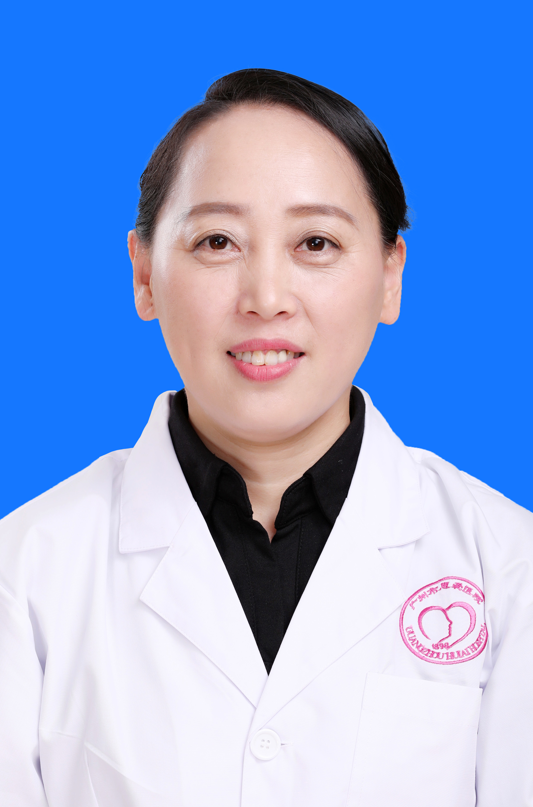

<!-- AUTO-GENERATED-BY: work/generate_obsidian_profiles.py -->

<!-- TEMPLATE: D:\workspace\信息收集整理\医生画像仓库\模板\医生画像模板.md -->

# 江帆

## 基础信息

| 字段 | 内容 |
|---|---|
| 姓名 | 江帆 |
| 医院 | 广州医科大学附属脑科医院 |
| 科室 | 心身（睡眠）医学科 |
| 职称/身份 | 副主任医师 |
| 来源链接 | [官网原文](https://www.gzbrain.cn/myzj/info_itemid_507.html) |
| 采集日期 | 2026-08-13 |

## 简介/擅长

睡眠障碍、焦虑障碍、抑郁障碍、心身障碍等。

## 科研项目与成果

- 从事睡眠障碍和精神疾病的临床、科研、教学以及健康教育工作，曾在杂志和报纸等媒体上发表多篇专业论文和科普文章。

## 论文与学术产出

- 从事睡眠障碍和精神疾病的临床、科研、教学以及健康教育工作，曾在杂志和报纸等媒体上发表多篇专业论文和科普文章。

## 可包装亮点

- 江帆，女，副主任医师，广州市惠爱医院心身医学科副主任、睡眠障碍科副主任。
- 现任中国睡眠研究会睡眠与心理卫生专业委员会常委、中国医师协会睡眠医学专业委员会精神心理学组委员、广东省中西医结合学会睡眠心理专业委员会副主任委员、广东省医师协会睡眠医学专业医师分会常委、广东省医学会睡眠医学分会委员、广东省医学会医学科普学分会委员、广东省生物医学工程学会信息工程分会常委、广东省临床医学学会-移动医疗专业委员会委员、广东省临床医学学会-华南名…
- 从事睡眠障碍和精神疾病的临床、科研、教学以及健康教育工作，曾在杂志和报纸等媒体上发表多篇专业论文和科普文章。

## 重点疾病/人群标签

- 慢性病：
- 肿瘤：
- 生殖疾病：
- 免疫/风湿：
- 术后恢复/康复：
- 疑难重症：

## 证据摘录

> 只摘录官网公开信息中的短句或关键字段，不复制大段原文。

- 官网身份字段：副主任医师
- 官网简介/擅长：睡眠障碍、焦虑障碍、抑郁障碍、心身障碍等。
- 官网亮眼经历线索：江帆，女，副主任医师，广州市惠爱医院心身医学科副主任、睡眠障碍科副主任。 现任中国睡眠研究会睡眠与心理卫生专业委员会常委、中国医师协会睡眠医学专业委员会精神心理学组委员、广东省中西医结合学会睡眠心理专业委员会副主任委员、广东省医师协会睡眠医学专业医师分会常委、广东省医学会睡眠医学分会委员、广东省医学会医学科普学分会委员、广东省生物医学工程学会信息工程分会常委、广东省临床医学学会-移动医疗专业委员会委员、广东省临床医学学会-华南名医专家…
- 来源链接：https://www.gzbrain.cn/myzj/info_itemid_507.html

## BD 画像摘要

江帆医生可作为广州医科大学附属脑科医院心身（睡眠）医学科的基础医生资料入库。当前重点方向以总底表标签为准，官网未展示的信息保持空白。

## 合规边界

- 仅使用医院官网、官方公众号、官方小程序等公开渠道。
- 不采集私人电话、私人微信、家庭住址、患者隐私或非公开排班信息。
- 不写“保证治愈”“疗效第一”“包治疑难杂症”等无法由官网证明的表述。
