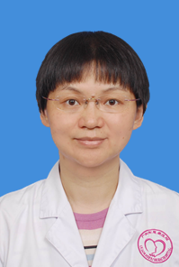

<!-- AUTO-GENERATED-BY: work/generate_obsidian_profiles.py -->

<!-- TEMPLATE: D:\workspace\信息收集整理\医生画像仓库\模板\医生画像模板.md -->

# 沐楠

## 基础信息

| 字段 | 内容 |
|---|---|
| 姓名 | 沐楠 |
| 医院 | 广州医科大学附属脑科医院 |
| 科室 | 老年精神科 |
| 职称/身份 | 主任医师 |
| 来源链接 | [官网原文](https://www.gzbrain.cn/myzj/info_itemid_479.html) |
| 采集日期 | 2026-08-13 |

## 简介/擅长

老人精神障碍与健康，包括抑郁症、焦虑症、记忆障碍、分裂症等。

## 教育与进修经历

- 医学博士，老年科科主任， 1995 年湖南医科大学临床医学系毕业后在广州市惠爱医院从事精神科临床、教学、科研工作至今20余年。

## 科研项目与成果

- 医学博士，老年科科主任， 1995 年湖南医科大学临床医学系毕业后在广州市惠爱医院从事精神科临床、教学、科研工作至今20余年。

## 可包装亮点

- 医学博士，老年科科主任， 1995 年湖南医科大学临床医学系毕业后在广州市惠爱医院从事精神科临床、教学、科研工作至今20余年。
- 2006年在McGill大学精神病学系和附属Douglas医院进行临床访问。
- 现任中国老年医学学会认知障碍分会委员，中国老年医学学会精神医学与心理健康分会委员，广东省保健协会抗衰老及脑变性病防治委员会常委等。

## 重点疾病/人群标签

- 慢性病：
- 肿瘤：
- 生殖疾病：
- 免疫/风湿：
- 术后恢复/康复：
- 疑难重症：

## 证据摘录

> 只摘录官网公开信息中的短句或关键字段，不复制大段原文。

- 官网身份字段：主任医师
- 官网简介/擅长：老人精神障碍与健康，包括抑郁症、焦虑症、记忆障碍、分裂症等。
- 官网亮眼经历线索：医学博士，老年科科主任， 1995 年湖南医科大学临床医学系毕业后在广州市惠爱医院从事精神科临床、教学、科研工作至今20余年。 2006年在McGill大学精神病学系和附属Douglas医院进行临床访问。 现任中国老年医学学会认知障碍分会委员，中国老年医学学会精神医学与心理健康分会委员，广东省保健协会抗衰老及脑变性病防治委员会常委等。
- 来源链接：https://www.gzbrain.cn/myzj/info_itemid_479.html

## BD 画像摘要

沐楠医生可作为广州医科大学附属脑科医院老年精神科的基础医生资料入库。当前重点方向以总底表标签为准，官网未展示的信息保持空白。

## 合规边界

- 仅使用医院官网、官方公众号、官方小程序等公开渠道。
- 不采集私人电话、私人微信、家庭住址、患者隐私或非公开排班信息。
- 不写“保证治愈”“疗效第一”“包治疑难杂症”等无法由官网证明的表述。
