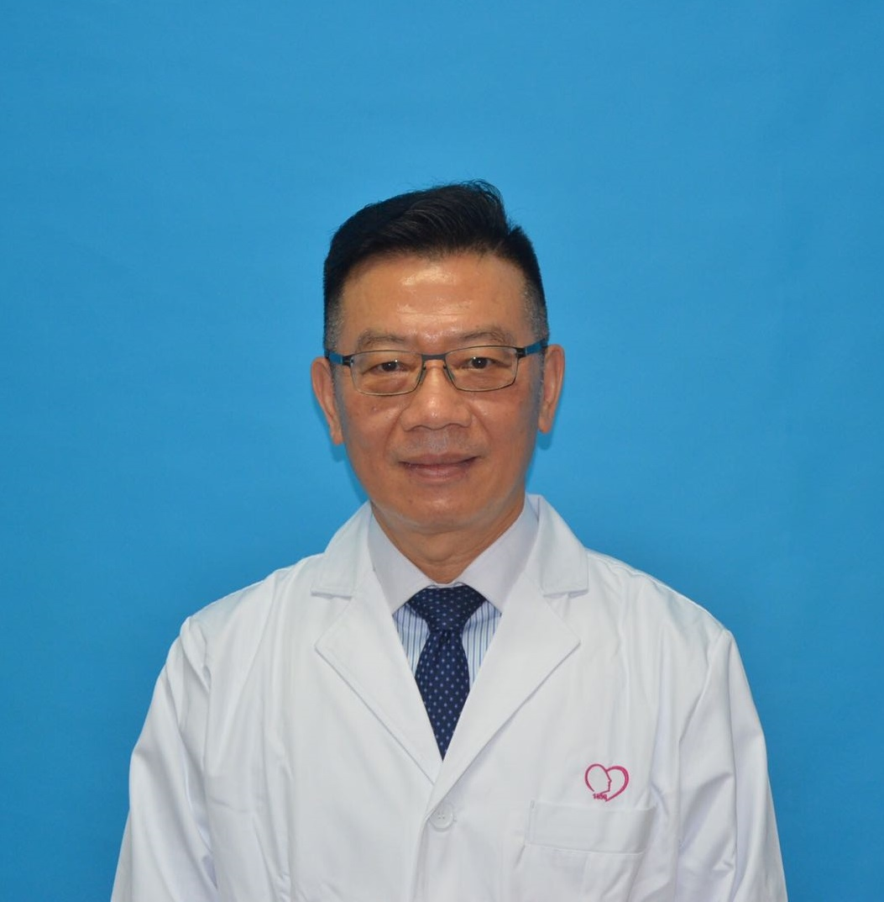

<!-- AUTO-GENERATED-BY: work/generate_obsidian_profiles.py -->

<!-- TEMPLATE: D:\workspace\信息收集整理\医生画像仓库\模板\医生画像模板.md -->

# 王德贤

## 基础信息

| 字段 | 内容 |
|---|---|
| 姓名 | 王德贤 |
| 医院 | 广州医科大学附属脑科医院 |
| 科室 | 临床心理科 |
| 职称/身份 | 心理治疗师 |
| 来源链接 | [官网原文](https://www.gzbrain.cn/myzj/info_itemid_11793.html) |
| 采集日期 | 2026-08-13 |

## 简介/擅长

压力调适、焦虑、创伤后应激、轻度-中度抑郁、原发性/心因性失眠、婚姻治疗、青少年问题、亲子关系

## 可包装亮点

- 个人简介： 美国密苏里州中央密苏里州立大学（现为中央密苏里大学）心理研究所临床心理学组硕士。
- 领有美国（副心理师）、加拿大（临床咨商师）、中国内地地区（国家二级心理咨询师）和中国台湾地区（临床心理师）的证照。
- 执业超过三十年，临床经验是国际性的，涵盖美国、加拿大、中国等三个国家。

## 重点疾病/人群标签

- 慢性病：
- 肿瘤：
- 生殖疾病：
- 免疫/风湿：
- 术后恢复/康复：
- 疑难重症：

## 证据摘录

> 只摘录官网公开信息中的短句或关键字段，不复制大段原文。

- 官网身份字段：心理治疗师
- 官网简介/擅长：压力调适、焦虑、创伤后应激、轻度-中度抑郁、原发性/心因性失眠、婚姻治疗、青少年问题、亲子关系
- 官网亮眼经历线索：个人简介： 美国密苏里州中央密苏里州立大学（现为中央密苏里大学）心理研究所临床心理学组硕士。 领有美国（副心理师）、加拿大（临床咨商师）、中国内地地区（国家二级心理咨询师）和中国台湾地区（临床心理师）的证照。 执业超过三十年，临床经验是国际性的，涵盖美国、加拿大、中国等三个国家。
- 异常提示：职称/身份需人工复核
- 来源链接：https://www.gzbrain.cn/myzj/info_itemid_11793.html

## BD 画像摘要

王德贤医生可作为广州医科大学附属脑科医院临床心理科的基础医生资料入库。当前重点方向以总底表标签为准，官网未展示的信息保持空白。

## 合规边界

- 仅使用医院官网、官方公众号、官方小程序等公开渠道。
- 不采集私人电话、私人微信、家庭住址、患者隐私或非公开排班信息。
- 不写“保证治愈”“疗效第一”“包治疑难杂症”等无法由官网证明的表述。
