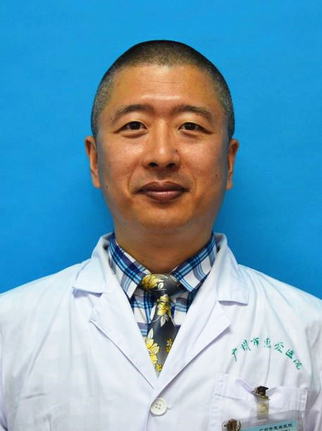

<!-- AUTO-GENERATED-BY: work/generate_obsidian_profiles.py -->

<!-- TEMPLATE: D:\workspace\信息收集整理\医生画像仓库\模板\医生画像模板.md -->

# 王金伟

## 基础信息

| 字段 | 内容 |
|---|---|
| 姓名 | 王金伟 |
| 医院 | 广州医科大学附属脑科医院 |
| 科室 | 神经外科 |
| 职称/身份 | 副主任医师 |
| 来源链接 | [官网原文](https://www.gzbrain.cn/myzj/info_itemid_1070.html) |
| 采集日期 | 2026-08-13 |

## 简介/擅长

脑外伤、脑肿瘤、脑血管病，神经及功能疾病，脊柱脊髓疾病，内镜手术治疗垂体瘤、脑积水、蛛网膜囊肿等。

## 教育与进修经历

- 中国抗癫痫协会会员、广东省健康管理学会神经外科分会委员、广东省抗癫痫学会会员、广东省医疗行业协会专科管理分会委员、中国医药教育协会颅神经疾病互联网医疗培训基地委员会委员、广州市意识障碍产学研创新联盟会员、广东省精准医学应用学会神经肿瘤分会委员，任《 Worldneurosurgery 》网络平台审稿委员会委员、《广东医学》杂志特约审稿专家。

## 科研项目与成果

- 从事神经外科近 20 年，熟练掌握神经外科的脑外伤、脑肿瘤、脑血管病、脊柱脊髓疾病以及先天性、感染性、功能性等各类神经外科疾病的诊断及治疗，完成了脑神经周围膜性解剖结构的课题研究及脑神经疾病的手术操作，熟悉神经外科 3D 手术入路，立体定向仪辅助下脑内靶点的精准定位及开展精神外科手术，对脊柱脊髓神经外科中颈椎病、腰椎病、椎间盘突出、脊柱脊髓外伤、椎管内肿瘤、脊髓血管病变、脊柱裂脊膜膨出、脊髓栓系、脊髓空洞症等进行了丰富的临床实践，善长神经内镜的使用，尤其是使用神经内镜治疗垂体瘤、脑室肿瘤、脑积水、蛛网膜囊肿、颅内…
- 完成省市级科研课题 6 项，主编著作 5 部，发表核心学术论文 16 篇，译著 8 篇。

## 论文与学术产出

- 完成省市级科研课题 6 项，主编著作 5 部，发表核心学术论文 16 篇，译著 8 篇。

## 可包装亮点

- 王金伟 神经外科副主任医师，医学博士。
- 从事神经外科近 20 年，熟练掌握神经外科的脑外伤、脑肿瘤、脑血管病、脊柱脊髓疾病以及先天性、感染性、功能性等各类神经外科疾病的诊断及治疗，完成了脑神经周围膜性解剖结构的课题研究及脑神经疾病的手术操作，熟悉神经外科 3D 手术入路，立体定向仪辅助下脑内靶点的精准定位及开展精神外科手术，对脊柱脊髓神经外科中颈椎病、腰椎病、椎间盘突出、脊柱脊髓外伤、椎管内肿瘤…
- 中国抗癫痫协会会员、广东省健康管理学会神经外科分会委员、广东省抗癫痫学会会员、广东省医疗行业协会专科管理分会委员、中国医药教育协会颅神经疾病互联网医疗培训基地委员会委员、广州市意识障碍产学研创新联盟会员、广东省精准医学应用学...

## 重点疾病/人群标签

- 慢性病：
- 肿瘤：肿瘤、瘤、感染
- 生殖疾病：
- 免疫/风湿：肿瘤、瘤、感染
- 术后恢复/康复：
- 疑难重症：

## 证据摘录

> 只摘录官网公开信息中的短句或关键字段，不复制大段原文。

- 官网身份字段：副主任医师
- 官网简介/擅长：脑外伤、脑肿瘤、脑血管病，神经及功能疾病，脊柱脊髓疾病，内镜手术治疗垂体瘤、脑积水、蛛网膜囊肿等。
- 官网亮眼经历线索：王金伟 神经外科副主任医师，医学博士。 从事神经外科近 20 年，熟练掌握神经外科的脑外伤、脑肿瘤、脑血管病、脊柱脊髓疾病以及先天性、感染性、功能性等各类神经外科疾病的诊断及治疗，完成了脑神经周围膜性解剖结构的课题研究及脑神经疾病的手术操作，熟悉神经外科 3D 手术入路，立体定向仪辅助下脑内靶点的精准定位及开展精神外科手术，对脊柱脊髓神经外科中颈椎病、腰椎病、椎间盘突出、脊柱脊髓外伤、椎管内肿瘤、脊髓血管病变、脊柱裂脊膜膨出、脊髓栓系…
- 来源链接：https://www.gzbrain.cn/myzj/info_itemid_1070.html

## BD 画像摘要

王金伟医生可作为肿瘤、免疫/风湿/感染方向的基础画像候选。后续 BD 使用应继续以官网来源和人工复核为准，不添加疗效承诺或无来源包装。

## 合规边界

- 仅使用医院官网、官方公众号、官方小程序等公开渠道。
- 不采集私人电话、私人微信、家庭住址、患者隐私或非公开排班信息。
- 不写“保证治愈”“疗效第一”“包治疑难杂症”等无法由官网证明的表述。
