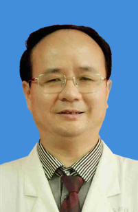

<!-- AUTO-GENERATED-BY: work/generate_obsidian_profiles.py -->

<!-- TEMPLATE: D:\workspace\信息收集整理\医生画像仓库\模板\医生画像模板.md -->

# 蒋泽宇

## 基础信息

| 字段 | 内容 |
|---|---|
| 姓名 | 蒋泽宇 |
| 医院 | 广州医科大学附属脑科医院 |
| 科室 | 情感障碍科 |
| 职称/身份 | 主任医师 |
| 来源链接 | [官网原文](https://www.gzbrain.cn/myzj/info_itemid_739.html) |
| 采集日期 | 2026-08-13 |

## 简介/擅长

情感障碍、社交恐惧症、强迫症、分裂症以及睡眠障碍、青少年行为障碍、进食障碍的诊治和心理咨询。

## 教育与进修经历

- 毕业于湖南医科大学精神卫生系，长期从事精神科临床、科研、教学工作。

## 科研项目与成果

- 毕业于湖南医科大学精神卫生系，长期从事精神科临床、科研、教学工作。
- 主持和参与过多项国家及省市级科研课题，发表专业论文20余篇。

## 论文与学术产出

- 主持和参与过多项国家及省市级科研课题，发表专业论文20余篇。

## 可包装亮点

- 病区主任，广州医科大学和广州中医药大学教授，广东省精神疾病司法鉴定专家，广州市医疗事故技术鉴定专家，广州市、广东省劳动能力鉴定医疗卫生专家，广东省医学会卫生委员会委员，中国睡眠研究会睡眠与心理卫生专业委员会委员，中国医疗保健国际交流促进会精神卫生分会文化与心理健康学组委员，广东省健康科普专家，广州市中小学卫生健康促进中心特聘心理专家。
- 主持和参与过多项国家及省市级科研课题，发表专业论文20余篇。
- 2016年、2017年和2018年连续三年入选“岭南名医”。
- 2017年获得“羊城好医生”荣誉称号。

## 重点疾病/人群标签

- 慢性病：
- 肿瘤：
- 生殖疾病：
- 免疫/风湿：
- 术后恢复/康复：
- 疑难重症：

## 证据摘录

> 只摘录官网公开信息中的短句或关键字段，不复制大段原文。

- 官网身份字段：主任医师
- 官网简介/擅长：情感障碍、社交恐惧症、强迫症、分裂症以及睡眠障碍、青少年行为障碍、进食障碍的诊治和心理咨询。
- 官网亮眼经历线索：病区主任，广州医科大学和广州中医药大学教授，广东省精神疾病司法鉴定专家，广州市医疗事故技术鉴定专家，广州市、广东省劳动能力鉴定医疗卫生专家，广东省医学会卫生委员会委员，中国睡眠研究会睡眠与心理卫生专业委员会委员，中国医疗保健国际交流促进会精神卫生分会文化与心理健康学组委员，广东省健康科普专家，广州市中小学卫生健康促进中心特聘心理专家。 主持和参与过多项国家及省市级科研课题，发表专业论文20余篇。 2016年、2017年和2018年连续…
- 来源链接：https://www.gzbrain.cn/myzj/info_itemid_739.html

## BD 画像摘要

蒋泽宇医生可作为广州医科大学附属脑科医院情感障碍科的基础医生资料入库。当前重点方向以总底表标签为准，官网未展示的信息保持空白。

## 合规边界

- 仅使用医院官网、官方公众号、官方小程序等公开渠道。
- 不采集私人电话、私人微信、家庭住址、患者隐私或非公开排班信息。
- 不写“保证治愈”“疗效第一”“包治疑难杂症”等无法由官网证明的表述。
