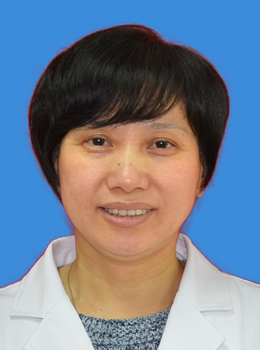

<!-- AUTO-GENERATED-BY: work/generate_obsidian_profiles.py -->

<!-- TEMPLATE: D:\workspace\信息收集整理\医生画像仓库\模板\医生画像模板.md -->

# 赵素华

## 基础信息

| 字段 | 内容 |
|---|---|
| 姓名 | 赵素华 |
| 医院 | 广州医科大学附属脑科医院 |
| 科室 | 精神科 |
| 职称/身份 | 主任医师 |
| 来源链接 | [官网原文](https://www.gzbrain.cn/myzj/info_itemid_5375.html) |
| 采集日期 | 2026-08-13 |

## 简介/擅长

抑郁症、焦虑症、失眠、精神分裂症、叙事、认知心理治疗。

## 科研项目与成果

- 主要从事精神科临床工作，同时承担教学、科研及管理工作。
- 主持过省、市级课题，发表学术论文多篇，致力于抑郁、焦虑及睡眠障碍方面的研究。

## 论文与学术产出

- 主持过省、市级课题，发表学术论文多篇，致力于抑郁、焦虑及睡眠障碍方面的研究。

## 可包装亮点

- 精神科主任医师，社区精神科副主任。
- 社会兼职：广东省心理健康专家、广东省心理协会会员、广东省女医师协会心理健康专业委员会委员、广州市紧急医学救援心理救援专家。
- 主持过省、市级课题，发表学术论文多篇，致力于抑郁、焦虑及睡眠障碍方面的研究。

## 重点疾病/人群标签

- 慢性病：
- 肿瘤：
- 生殖疾病：
- 免疫/风湿：
- 术后恢复/康复：
- 疑难重症：

## 证据摘录

> 只摘录官网公开信息中的短句或关键字段，不复制大段原文。

- 官网身份字段：主任医师
- 官网简介/擅长：抑郁症、焦虑症、失眠、精神分裂症、叙事、认知心理治疗。
- 官网亮眼经历线索：精神科主任医师，社区精神科副主任。 社会兼职：广东省心理健康专家、广东省心理协会会员、广东省女医师协会心理健康专业委员会委员、广州市紧急医学救援心理救援专家。 主持过省、市级课题，发表学术论文多篇，致力于抑郁、焦虑及睡眠障碍方面的研究。
- 来源链接：https://www.gzbrain.cn/myzj/info_itemid_5375.html

## BD 画像摘要

赵素华医生可作为广州医科大学附属脑科医院精神科的基础医生资料入库。当前重点方向以总底表标签为准，官网未展示的信息保持空白。

## 合规边界

- 仅使用医院官网、官方公众号、官方小程序等公开渠道。
- 不采集私人电话、私人微信、家庭住址、患者隐私或非公开排班信息。
- 不写“保证治愈”“疗效第一”“包治疑难杂症”等无法由官网证明的表述。
