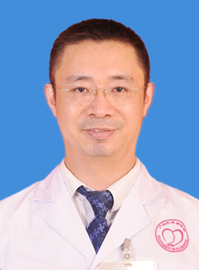

<!-- AUTO-GENERATED-BY: work/generate_obsidian_profiles.py -->

<!-- TEMPLATE: D:\workspace\信息收集整理\医生画像仓库\模板\医生画像模板.md -->

# 郑东

## 基础信息

| 字段 | 内容 |
|---|---|
| 姓名 | 郑东 |
| 医院 | 广州医科大学附属脑科医院 |
| 科室 | 神经康复科 |
| 职称/身份 | 主任医师 |
| 来源链接 | [官网原文](https://www.gzbrain.cn/myzj/info_itemid_533.html) |
| 采集日期 | 2026-08-13 |

## 简介/擅长

脑血管病、帕金森病、认知障碍、头颈痛、神经系统疾病伴发的抑郁焦虑、植物神经功能紊乱的预防逆转及康复；擅长应用脑机接口等高新科技进行神经调控治疗。

## 科研项目与成果

- 获专利3项。

## 论文与学术产出

- 参编《中毒性脑病》、《鼻咽癌放疗后神经损伤学》、《精神病学》、《老年痴呆居家康复》等书籍；

## 可包装亮点

- 郑东，主任医师，医学博士，研究生导师。
- 深耕神经免疫、神经调控的基础研究，先后晋升精神科副主任医师和神经内科主任医师，兼具精神科和神经内科知识体系。
- 尤擅诊治神经科与精神科复杂疑难共病。
- 现任广东省老年保健协会老年康复专委会主委、中国心胸血管麻醉学会脑与血管分会常委、传统医学会头痛专委会副主委；

## 重点疾病/人群标签

- 慢性病：
- 肿瘤：放疗、鼻咽癌、免疫、康复、疑难、复杂
- 生殖疾病：
- 免疫/风湿：放疗、鼻咽癌、免疫、康复、疑难、复杂
- 术后恢复/康复：放疗、鼻咽癌、免疫、康复、疑难、复杂
- 疑难重症：放疗、鼻咽癌、免疫、康复、疑难、复杂

## 证据摘录

> 只摘录官网公开信息中的短句或关键字段，不复制大段原文。

- 官网身份字段：主任医师
- 官网简介/擅长：脑血管病、帕金森病、认知障碍、头颈痛、神经系统疾病伴发的抑郁焦虑、植物神经功能紊乱的预防逆转及康复；擅长应用脑机接口等高新科技进行神经调控治疗。
- 官网亮眼经历线索：郑东，主任医师，医学博士，研究生导师。 深耕神经免疫、神经调控的基础研究，先后晋升精神科副主任医师和神经内科主任医师，兼具精神科和神经内科知识体系。 尤擅诊治神经科与精神科复杂疑难共病。 现任广东省老年保健协会老年康复专委会主委、中国心胸血管麻醉学会脑与血管分会常委、传统医学会头痛专委会副主委；
- 来源链接：https://www.gzbrain.cn/myzj/info_itemid_533.html

## BD 画像摘要

郑东医生可作为肿瘤、免疫/风湿/感染、术后恢复/康复、疑难重症方向的基础画像候选。后续 BD 使用应继续以官网来源和人工复核为准，不添加疗效承诺或无来源包装。

## 合规边界

- 仅使用医院官网、官方公众号、官方小程序等公开渠道。
- 不采集私人电话、私人微信、家庭住址、患者隐私或非公开排班信息。
- 不写“保证治愈”“疗效第一”“包治疑难杂症”等无法由官网证明的表述。
