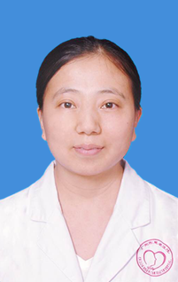

<!-- AUTO-GENERATED-BY: work/generate_obsidian_profiles.py -->

<!-- TEMPLATE: D:\workspace\信息收集整理\医生画像仓库\模板\医生画像模板.md -->

# 郭彩凤

## 基础信息

| 字段 | 内容 |
|---|---|
| 姓名 | 郭彩凤 |
| 医院 | 广州医科大学附属脑科医院 |
| 科室 | 神经内科 |
| 职称/身份 | 主治医师 |
| 来源链接 | [官网原文](https://www.gzbrain.cn/myzj/info_itemid_536.html) |
| 采集日期 | 2026-08-13 |

## 简介/擅长

脑血管病、癫痫、脑炎、头痛、睡眠障碍、各种痴呆及器质性精神疾病的诊治。

## 教育与进修经历

- 2009年毕业于山西医科大学本硕连读班。
- 期间曾北京宣武医院进修睡眠脑电。

## 科研项目与成果

- 2012年7月至今工作于广州市惠爱医院，一直从事临床医学及科研工作。
- 参与多项国家、省市级科研项目。

## 可包装亮点

- 中国睡眠研究会青年委员会委员，广州医师协会神内分会委员。
- 期间曾北京宣武医院进修睡眠脑电。

## 重点疾病/人群标签

- 慢性病：
- 肿瘤：
- 生殖疾病：
- 免疫/风湿：
- 术后恢复/康复：
- 疑难重症：

## 证据摘录

> 只摘录官网公开信息中的短句或关键字段，不复制大段原文。

- 官网身份字段：主治医师
- 官网简介/擅长：脑血管病、癫痫、脑炎、头痛、睡眠障碍、各种痴呆及器质性精神疾病的诊治。
- 官网亮眼经历线索：中国睡眠研究会青年委员会委员，广州医师协会神内分会委员。 期间曾北京宣武医院进修睡眠脑电。
- 来源链接：https://www.gzbrain.cn/myzj/info_itemid_536.html

## BD 画像摘要

郭彩凤医生可作为广州医科大学附属脑科医院神经内科的基础医生资料入库。当前重点方向以总底表标签为准，官网未展示的信息保持空白。

## 合规边界

- 仅使用医院官网、官方公众号、官方小程序等公开渠道。
- 不采集私人电话、私人微信、家庭住址、患者隐私或非公开排班信息。
- 不写“保证治愈”“疗效第一”“包治疑难杂症”等无法由官网证明的表述。
