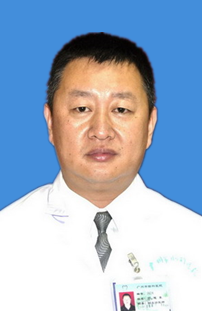

<!-- AUTO-GENERATED-BY: work/generate_obsidian_profiles.py -->

<!-- TEMPLATE: D:\workspace\信息收集整理\医生画像仓库\模板\医生画像模板.md -->

# 郭旭东

## 基础信息

| 字段 | 内容 |
|---|---|
| 姓名 | 郭旭东 |
| 医院 | 广州医科大学附属脑科医院 |
| 科室 | 神经外科 |
| 职称/身份 | 副主任医师 |
| 来源链接 | [官网原文](https://www.gzbrain.cn/myzj/info_itemid_940.html) |
| 采集日期 | 2026-08-13 |

## 简介/擅长

脑肿瘤、脊髓内肿瘤、脑血管病、癫痫、三叉神经痛。

## 论文与学术产出

- 发表国家级期刊专业论文 10 余篇，获市级科技进步一等奖 1 项。

## 可包装亮点

- 郭旭东 神经外科副主任医师，医学硕士。
- 从事神经外科工作 20 余年，基础理论扎实，作风严谨，技术精湛、全面，熟练掌握神经外科各类疾病的诊断及治疗，对神经外科的疑难、危重病例有着丰富的临床治疗经验，尤其擅长颅内外肿瘤、后颅凹肿瘤、鞍区肿瘤，颅内动脉瘤、脑血管动静脉畸形、脊髓栓系、椎管狭窄及椎管内外肿瘤等疾病手术治疗具有很深的造诣。
- 目前担任广东省基层医药学会神经外科专业委员会常务委员、广东省医学教育学会神经外科专业委员会委员、中国医师协会神经修复学会卒中组委员、广东省中西医结合神经肿瘤协会委员、广东省医学会神经外科分会青年委员、广东省健康管理学会神经外科分会委员、中国神经调控理联盟事会理事。
- 发表国家级期刊专业论文 10 余篇，获市级科技进步一等奖 1 项。

## 重点疾病/人群标签

- 慢性病：
- 肿瘤：肿瘤、瘤、疑难、危重
- 生殖疾病：
- 免疫/风湿：
- 术后恢复/康复：
- 疑难重症：肿瘤、瘤、疑难、危重

## 证据摘录

> 只摘录官网公开信息中的短句或关键字段，不复制大段原文。

- 官网身份字段：副主任医师
- 官网简介/擅长：脑肿瘤、脊髓内肿瘤、脑血管病、癫痫、三叉神经痛。
- 官网亮眼经历线索：郭旭东 神经外科副主任医师，医学硕士。 从事神经外科工作 20 余年，基础理论扎实，作风严谨，技术精湛、全面，熟练掌握神经外科各类疾病的诊断及治疗，对神经外科的疑难、危重病例有着丰富的临床治疗经验，尤其擅长颅内外肿瘤、后颅凹肿瘤、鞍区肿瘤，颅内动脉瘤、脑血管动静脉畸形、脊髓栓系、椎管狭窄及椎管内外肿瘤等疾病手术治疗具有很深的造诣。 目前担任广东省基层医药学会神经外科专业委员会常务委员、广东省医学教育学会神经外科专业委员会委员、中国医师…
- 来源链接：https://www.gzbrain.cn/myzj/info_itemid_940.html

## BD 画像摘要

郭旭东医生可作为肿瘤、疑难重症方向的基础画像候选。后续 BD 使用应继续以官网来源和人工复核为准，不添加疗效承诺或无来源包装。

## 合规边界

- 仅使用医院官网、官方公众号、官方小程序等公开渠道。
- 不采集私人电话、私人微信、家庭住址、患者隐私或非公开排班信息。
- 不写“保证治愈”“疗效第一”“包治疑难杂症”等无法由官网证明的表述。
