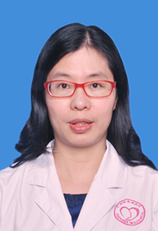

<!-- AUTO-GENERATED-BY: work/generate_obsidian_profiles.py -->

<!-- TEMPLATE: D:\workspace\信息收集整理\医生画像仓库\模板\医生画像模板.md -->

# 钟笑梅

## 基础信息

| 字段 | 内容 |
|---|---|
| 姓名 | 钟笑梅 |
| 医院 | 广州医科大学附属脑科医院 |
| 科室 | 记忆门诊 |
| 职称/身份 | 副主任医师 |
| 来源链接 | [官网原文](https://www.gzbrain.cn/myzj/info_itemid_5310.html) |
| 采集日期 | 2026-08-13 |

## 简介/擅长

记忆力下降、痴呆、老年抑郁症、老年期精神行为异常的诊治。

## 科研项目与成果

- 曾到瑞典卡罗林斯卡医学院、澳门大学研修，主要从事老年精神医学的临床工作和科研，尤其在记忆力下降、阿尔茨海默病、老年抑郁症、睡眠障碍的诊疗上积累了丰富的经验。
- 主持国家自然科学基金青年项目 1 项、广州市科学研究专项 1 项、广州市医药卫生姓名 1 项，参与国家级课题 3 项，发表研究论文 33 篇，其中以第一作者发表 SCI 研究论著 9 篇，作为主要完成人获“广州市科学技术进步二等奖 ” 1 项。

## 论文与学术产出

- 主持国家自然科学基金青年项目 1 项、广州市科学研究专项 1 项、广州市医药卫生姓名 1 项，参与国家级课题 3 项，发表研究论文 33 篇，其中以第一作者发表 SCI 研究论著 9 篇，作为主要完成人获“广州市科学技术进步二等奖 ” 1 项。

## 可包装亮点

- 钟笑梅 , 女，博士，副主任医师，副院长，广东省杰出青年医学人才，兼任中国老年医学学会精神医学与心理健康分会青年委员会副主任委员、中国老年医学会认知障碍分会青年委员会副秘书长、中国老年医学会认知障碍分会委员、广东省医学会精神病学分会老年医学学组秘书等多项学术任职。
- 曾到瑞典卡罗林斯卡医学院、澳门大学研修，主要从事老年精神医学的临床工作和科研，尤其在记忆力下降、阿尔茨海默病、老年抑郁症、睡眠障碍的诊疗上积累了丰富的经验。
- 主持国家自然科学基金青年项目 1 项、广州市科学研究专项 1 项、广州市医药卫生姓名 1 项，参与国家级课题 3 项，发表研究论文 33 篇，其中以第一作者发表 SCI 研究论著 9 篇，作为主要完成人获“广州市科学技术进步二等奖 ” 1 项。

## 重点疾病/人群标签

- 慢性病：
- 肿瘤：
- 生殖疾病：
- 免疫/风湿：
- 术后恢复/康复：
- 疑难重症：

## 证据摘录

> 只摘录官网公开信息中的短句或关键字段，不复制大段原文。

- 官网身份字段：副主任医师
- 官网简介/擅长：记忆力下降、痴呆、老年抑郁症、老年期精神行为异常的诊治。
- 官网亮眼经历线索：钟笑梅 , 女，博士，副主任医师，副院长，广东省杰出青年医学人才，兼任中国老年医学学会精神医学与心理健康分会青年委员会副主任委员、中国老年医学会认知障碍分会青年委员会副秘书长、中国老年医学会认知障碍分会委员、广东省医学会精神病学分会老年医学学组秘书等多项学术任职。 曾到瑞典卡罗林斯卡医学院、澳门大学研修，主要从事老年精神医学的临床工作和科研，尤其在记忆力下降、阿尔茨海默病、老年抑郁症、睡眠障碍的诊疗上积累了丰富的经验。 主持国家自然科…
- 来源链接：https://www.gzbrain.cn/myzj/info_itemid_5310.html

## BD 画像摘要

钟笑梅医生可作为广州医科大学附属脑科医院记忆门诊的基础医生资料入库。当前重点方向以总底表标签为准，官网未展示的信息保持空白。

## 合规边界

- 仅使用医院官网、官方公众号、官方小程序等公开渠道。
- 不采集私人电话、私人微信、家庭住址、患者隐私或非公开排班信息。
- 不写“保证治愈”“疗效第一”“包治疑难杂症”等无法由官网证明的表述。
