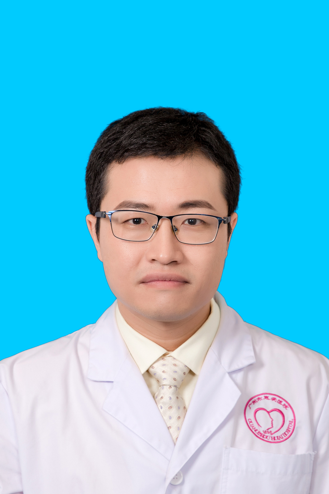

<!-- AUTO-GENERATED-BY: work/generate_obsidian_profiles.py -->

<!-- TEMPLATE: D:\workspace\信息收集整理\医生画像仓库\模板\医生画像模板.md -->

# 黄俊东

## 基础信息

| 字段 | 内容 |
|---|---|
| 姓名 | 黄俊东 |
| 医院 | 广州医科大学附属脑科医院 |
| 科室 | 中医内科 |
| 职称/身份 | 副主任医师 |
| 来源链接 | [官网原文](https://www.gzbrain.cn/myzj/info_itemid_6349.html) |
| 采集日期 | 2026-08-13 |

## 简介/擅长

中医“辩证施治”，中西医结合治疗分裂症，情感障碍，神经症等多种精神疾病。

## 教育与进修经历

- 毕业于广州中医药大学临床中医学系，为我院申请及建设国家中医药管理局“十二五”重点专科神志病科的核心骨干成员。

## 可包装亮点

- 毕业于广州中医药大学临床中医学系，为我院申请及建设国家中医药管理局“十二五”重点专科神志病科的核心骨干成员。
- 参与“中西医结合病区”专科的建设及发展工作，对中西医治疗精神病的发展有深厚的了解。

## 重点疾病/人群标签

- 慢性病：
- 肿瘤：
- 生殖疾病：
- 免疫/风湿：
- 术后恢复/康复：
- 疑难重症：

## 证据摘录

> 只摘录官网公开信息中的短句或关键字段，不复制大段原文。

- 官网身份字段：副主任医师
- 官网简介/擅长：中医“辩证施治”，中西医结合治疗分裂症，情感障碍，神经症等多种精神疾病。
- 官网亮眼经历线索：毕业于广州中医药大学临床中医学系，为我院申请及建设国家中医药管理局“十二五”重点专科神志病科的核心骨干成员。 参与“中西医结合病区”专科的建设及发展工作，对中西医治疗精神病的发展有深厚的了解。
- 来源链接：https://www.gzbrain.cn/myzj/info_itemid_6349.html

## BD 画像摘要

黄俊东医生可作为广州医科大学附属脑科医院中医内科的基础医生资料入库。当前重点方向以总底表标签为准，官网未展示的信息保持空白。

## 合规边界

- 仅使用医院官网、官方公众号、官方小程序等公开渠道。
- 不采集私人电话、私人微信、家庭住址、患者隐私或非公开排班信息。
- 不写“保证治愈”“疗效第一”“包治疑难杂症”等无法由官网证明的表述。
