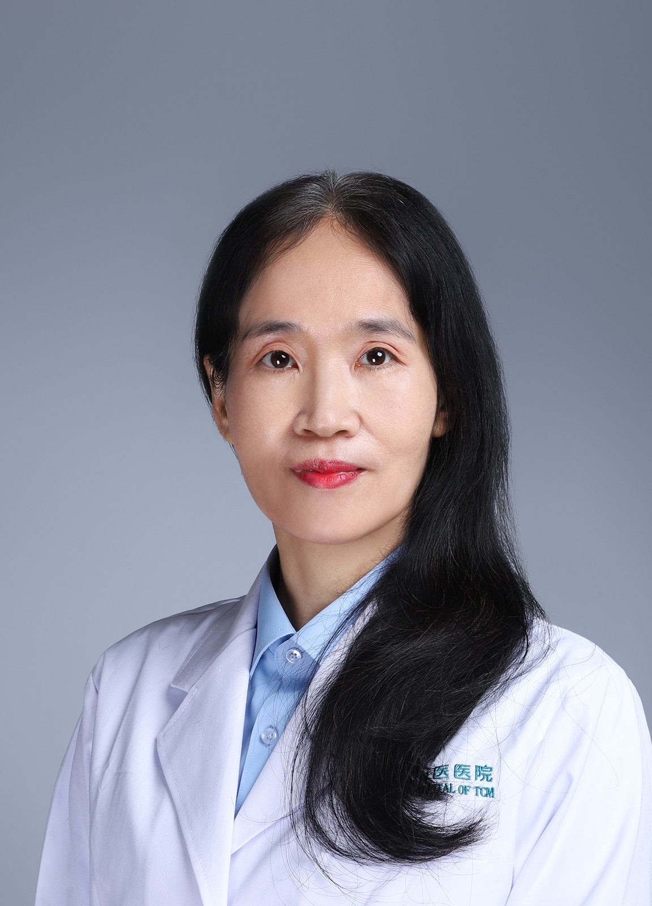

<!-- AUTO-GENERATED-BY: work/generate_obsidian_profiles.py -->

<!-- TEMPLATE: D:\workspace\信息收集整理\医生画像仓库\模板\医生画像模板.md -->

# 丘梅清

## 基础信息

| 字段 | 内容 |
|---|---|
| 姓名 | 丘梅清 |
| 医院 | 广州市中医院 |
| 科室 | 肺病科（呼吸内科） |
| 职称/身份 | 主任中医师 |
| 来源链接 | [官网原文](https://www.gzszyy.com/expert/2026/4zbq2Rdp.html) |
| 采集日期 | 2026-08-13 |

## 简介/擅长

从事临床工作三十余年，擅长中西医结合预防和治疗内科特别是呼吸系统疾病

## 教育与进修经历

- 1984年毕业于广州中医药大学中医系本科，曾在现中国中医研究院广安门医院心肺科工作，期间师从第一批国医大师路志正教授。
- 1990年获广州中医药大学硕士学位，期间先后在广东省人民医院呼吸科及北京东直门医院呼吸科进修。

## 可包装亮点

- 1990年获广州中医药大学硕士学位，期间先后在广东省人民医院呼吸科及北京东直门医院呼吸科进修。
- 为全国、省、市中医优秀人才，师从国医大师孙光荣教授、名中医药家祝之友教授、彭坚教授、邱志楠教授、李赛美、梁直英教授。
- 任广东省中医药学会经方临床研究专业委员会第一届委员会常务委员，中国中医药现代远程教育杂志社呼吸专科编委会副主任委员， 主治：慢性咳嗽（顽咳）、急慢性鼻炎、咽炎、支气管炎、支气管哮喘、支气管扩张、慢性阻塞性肺病等疾病。

## 重点疾病/人群标签

- 慢性病：慢性
- 肿瘤：
- 生殖疾病：
- 免疫/风湿：
- 术后恢复/康复：
- 疑难重症：

## 证据摘录

> 只摘录官网公开信息中的短句或关键字段，不复制大段原文。

- 官网身份字段：主任中医师
- 官网简介/擅长：从事临床工作三十余年，擅长中西医结合预防和治疗内科特别是呼吸系统疾病
- 官网亮眼经历线索：1990年获广州中医药大学硕士学位，期间先后在广东省人民医院呼吸科及北京东直门医院呼吸科进修。 为全国、省、市中医优秀人才，师从国医大师孙光荣教授、名中医药家祝之友教授、彭坚教授、邱志楠教授、李赛美、梁直英教授。 任广东省中医药学会经方临床研究专业委员会第一届委员会常务委员，中国中医药现代远程教育杂志社呼吸专科编委会副主任委员， 主治：慢性咳嗽（顽咳）、急慢性鼻炎、咽炎、支气管炎、支气管哮喘、支气管扩张、慢性阻塞性肺病等疾病。
- 来源链接：https://www.gzszyy.com/expert/2026/4zbq2Rdp.html

## BD 画像摘要

丘梅清医生可作为慢性病方向的基础画像候选。后续 BD 使用应继续以官网来源和人工复核为准，不添加疗效承诺或无来源包装。

## 合规边界

- 仅使用医院官网、官方公众号、官方小程序等公开渠道。
- 不采集私人电话、私人微信、家庭住址、患者隐私或非公开排班信息。
- 不写“保证治愈”“疗效第一”“包治疑难杂症”等无法由官网证明的表述。
