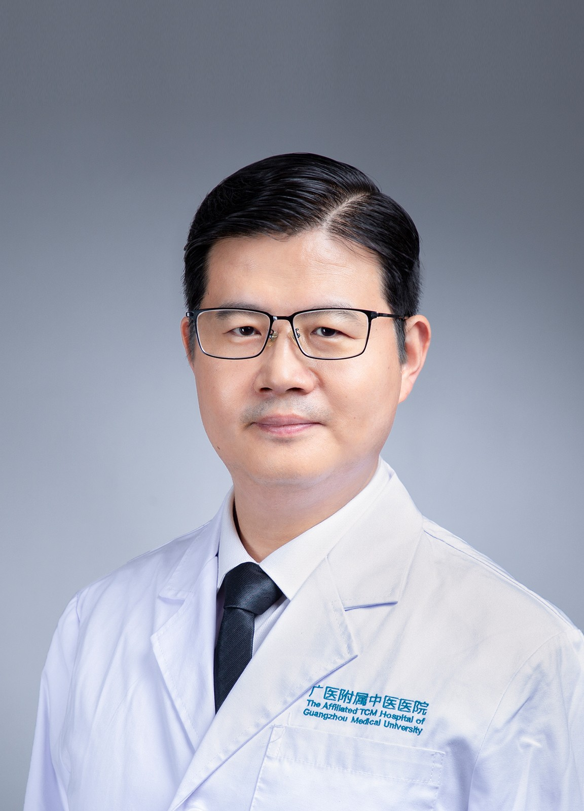

<!-- AUTO-GENERATED-BY: work/generate_obsidian_profiles.py -->

<!-- TEMPLATE: D:\workspace\信息收集整理\医生画像仓库\模板\医生画像模板.md -->

# 于林

## 基础信息

| 字段 | 内容 |
|---|---|
| 姓名 | 于林 |
| 医院 | 广州市中医院 |
| 科室 | 睡眠心理科 |
| 职称/身份 | 主任中医师 |
| 来源链接 | [官网原文](https://www.gzszyy.com/expert/2026/oQeZw2ap.html) |
| 采集日期 | 2026-08-13 |

## 简介/擅长

从脾胃调治神志疾病，倡导心理疏导，调动机体，形神同治，尤其擅长中西医结合调理睡眠障碍、抑郁症、焦虑症、情感障碍等睡眠心理问题，以及药物引起的性功能障碍、便秘、流涎、肥胖等疑难病症。

## 教育与进修经历

- 医学博士，中西医结合主任医师，教授，博士生导师，博士后合作导师，广东省杰出青年医学人才（第一批），青海省“高端创新人才千人计划”拔尖人才，广州市高层次人才，广州市医学重点人才。

## 可包装亮点

- 医学博士，中西医结合主任医师，教授，博士生导师，博士后合作导师，广东省杰出青年医学人才（第一批），青海省“高端创新人才千人计划”拔尖人才，广州市高层次人才，广州市医学重点人才。
- 中国民族医药学会神志病分会副会长，中华中医药学会神志病分会常务委员，广东省传统医学会神志病专业委员会顾问，广东省中西医结合学会睡眠心理专业委员会副主任委员。
- 临床重视从脾胃调治神志疾病，倡导心理疏导，调动机体，形神同治，尤其擅长中西医结合调理睡眠障碍、抑郁症、焦虑症、情感障碍等睡眠心理问题，以及药物引起的性功能障碍、便秘、流涎、肥胖等疑难病症。

## 重点疾病/人群标签

- 慢性病：
- 肿瘤：
- 生殖疾病：
- 免疫/风湿：
- 术后恢复/康复：功能障碍、疑难
- 疑难重症：功能障碍、疑难

## 证据摘录

> 只摘录官网公开信息中的短句或关键字段，不复制大段原文。

- 官网身份字段：主任中医师
- 官网简介/擅长：从脾胃调治神志疾病，倡导心理疏导，调动机体，形神同治，尤其擅长中西医结合调理睡眠障碍、抑郁症、焦虑症、情感障碍等睡眠心理问题，以及药物引起的性功能障碍、便秘、流涎、肥胖等疑难病症。
- 官网亮眼经历线索：医学博士，中西医结合主任医师，教授，博士生导师，博士后合作导师，广东省杰出青年医学人才（第一批），青海省“高端创新人才千人计划”拔尖人才，广州市高层次人才，广州市医学重点人才。 中国民族医药学会神志病分会副会长，中华中医药学会神志病分会常务委员，广东省传统医学会神志病专业委员会顾问，广东省中西医结合学会睡眠心理专业委员会副主任委员。 临床重视从脾胃调治神志疾病，倡导心理疏导，调动机体，形神同治，尤其擅长中西医结合调理睡眠障碍、抑郁症…
- 来源链接：https://www.gzszyy.com/expert/2026/oQeZw2ap.html

## BD 画像摘要

于林医生可作为术后恢复/康复、疑难重症方向的基础画像候选。后续 BD 使用应继续以官网来源和人工复核为准，不添加疗效承诺或无来源包装。

## 合规边界

- 仅使用医院官网、官方公众号、官方小程序等公开渠道。
- 不采集私人电话、私人微信、家庭住址、患者隐私或非公开排班信息。
- 不写“保证治愈”“疗效第一”“包治疑难杂症”等无法由官网证明的表述。
