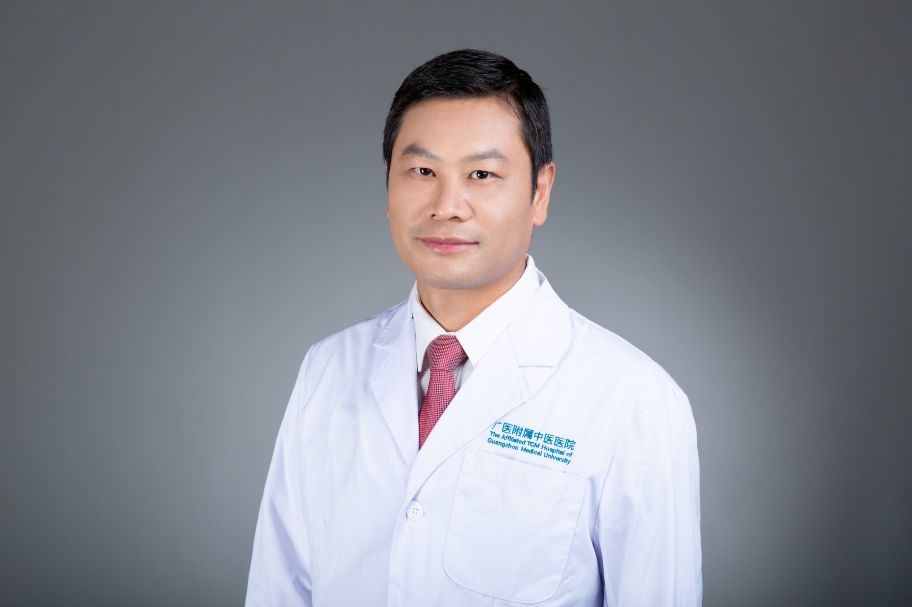

<!-- AUTO-GENERATED-BY: work/generate_obsidian_profiles.py -->

<!-- TEMPLATE: D:\workspace\信息收集整理\医生画像仓库\模板\医生画像模板.md -->

# 何平胜

## 基础信息

| 字段 | 内容 |
|---|---|
| 姓名 | 何平胜 |
| 医院 | 广州市中医院 |
| 科室 | 外科 |
| 职称/身份 | 主任医师 |
| 来源链接 | [官网原文](https://www.gzszyy.com/expert/2026/46dB82a7.html) |
| 采集日期 | 2026-08-13 |

## 简介/擅长

泌尿系肿瘤、肾输尿管结石、前列腺增生、男科的中西医治疗及微创手术

## 可包装亮点

- 广州医科大学附属中医医院天河院区外四科主任，主任医师，广州医科大学附属中医医院高层次人才 无党派人士、2022年河源市最美科技工作者，从事泌尿 外科 、中西医结合男科工作20年，主刀完成III、IV级手术达2000台以上，曾担任省级三甲医院泌尿 外科 学科带头人、县人民医院业务副院长，2023年、2024年在中山大学肿瘤医院、北京大学第一医院交流学习泌尿系…
- 中国性学会手术学分会全国委员，中国抗癌协会泌尿男生殖系肿瘤分会会员，肿瘤微创治疗委员会会员、腔镜与机器人 外科 分会会员，广东省中医药学会男性学专委会常委。

## 重点疾病/人群标签

- 慢性病：
- 肿瘤：肿瘤、癌、生殖
- 生殖疾病：肿瘤、癌、生殖
- 免疫/风湿：
- 术后恢复/康复：
- 疑难重症：

## 证据摘录

> 只摘录官网公开信息中的短句或关键字段，不复制大段原文。

- 官网身份字段：主任医师
- 官网简介/擅长：泌尿系肿瘤、肾输尿管结石、前列腺增生、男科的中西医治疗及微创手术
- 官网亮眼经历线索：广州医科大学附属中医医院天河院区外四科主任，主任医师，广州医科大学附属中医医院高层次人才 无党派人士、2022年河源市最美科技工作者，从事泌尿 外科 、中西医结合男科工作20年，主刀完成III、IV级手术达2000台以上，曾担任省级三甲医院泌尿 外科 学科带头人、县人民医院业务副院长，2023年、2024年在中山大学肿瘤医院、北京大学第一医院交流学习泌尿系肿瘤的微创、规范化治疗。 中国性学会手术学分会全国委员，中国抗癌协会泌尿男生殖系…
- 来源链接：https://www.gzszyy.com/expert/2026/46dB82a7.html

## BD 画像摘要

何平胜医生可作为肿瘤、生殖疾病方向的基础画像候选。后续 BD 使用应继续以官网来源和人工复核为准，不添加疗效承诺或无来源包装。

## 合规边界

- 仅使用医院官网、官方公众号、官方小程序等公开渠道。
- 不采集私人电话、私人微信、家庭住址、患者隐私或非公开排班信息。
- 不写“保证治愈”“疗效第一”“包治疑难杂症”等无法由官网证明的表述。
