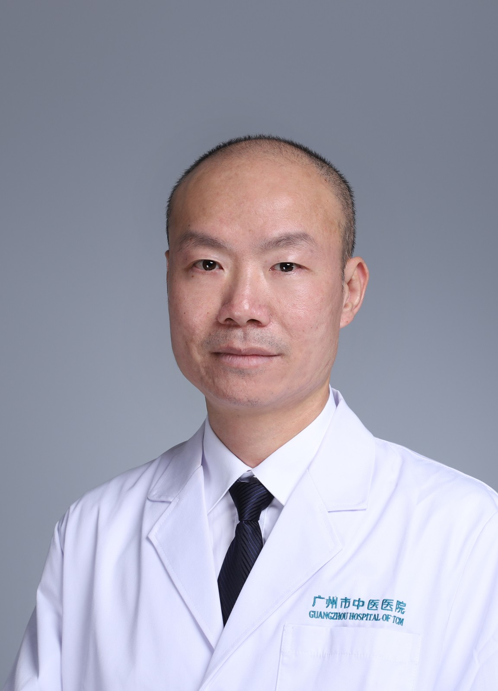

<!-- AUTO-GENERATED-BY: work/generate_obsidian_profiles.py -->

<!-- TEMPLATE: D:\workspace\信息收集整理\医生画像仓库\模板\医生画像模板.md -->

# 何润明

## 基础信息

| 字段 | 内容 |
|---|---|
| 姓名 | 何润明 |
| 医院 | 广州市中医院 |
| 科室 | 脾胃科（消化内科） |
| 职称/身份 | 主任中医师 |
| 来源链接 | [官网原文](https://www.gzszyy.com/expert/2026/jnegJYdw.html) |
| 采集日期 | 2026-08-13 |

## 简介/擅长

胃肠道、肝胆道疾病；内镜下止血、息肉切除等治疗。

## 教育与进修经历

- 广州医科大学附属中医医院同德院区脾胃科主任，主任中医师，医学硕士 毕业于广州中医药大学第一临床医学院，现任广东省肝病学会脂肪肝委员，中华医学会消化病分会，中国中医药学会会员，毕业后一直从事临床内科的诊治工作，对于消化病学内科疾病有一定的研究，熟练掌握内镜诊疗技术。

## 可包装亮点

- 广州医科大学附属中医医院同德院区脾胃科主任，主任中医师，医学硕士 毕业于广州中医药大学第一临床医学院，现任广东省肝病学会脂肪肝委员，中华医学会消化病分会，中国中医药学会会员，毕业后一直从事临床内科的诊治工作，对于消化病学内科疾病有一定的研究，熟练掌握内镜诊疗技术。

## 重点疾病/人群标签

- 慢性病：
- 肿瘤：
- 生殖疾病：
- 免疫/风湿：
- 术后恢复/康复：
- 疑难重症：

## 证据摘录

> 只摘录官网公开信息中的短句或关键字段，不复制大段原文。

- 官网身份字段：主任中医师
- 官网简介/擅长：胃肠道、肝胆道疾病；内镜下止血、息肉切除等治疗。
- 官网亮眼经历线索：广州医科大学附属中医医院同德院区脾胃科主任，主任中医师，医学硕士 毕业于广州中医药大学第一临床医学院，现任广东省肝病学会脂肪肝委员，中华医学会消化病分会，中国中医药学会会员，毕业后一直从事临床内科的诊治工作，对于消化病学内科疾病有一定的研究，熟练掌握内镜诊疗技术。
- 来源链接：https://www.gzszyy.com/expert/2026/jnegJYdw.html

## BD 画像摘要

何润明医生可作为广州市中医院脾胃科（消化内科）的基础医生资料入库。当前重点方向以总底表标签为准，官网未展示的信息保持空白。

## 合规边界

- 仅使用医院官网、官方公众号、官方小程序等公开渠道。
- 不采集私人电话、私人微信、家庭住址、患者隐私或非公开排班信息。
- 不写“保证治愈”“疗效第一”“包治疑难杂症”等无法由官网证明的表述。
