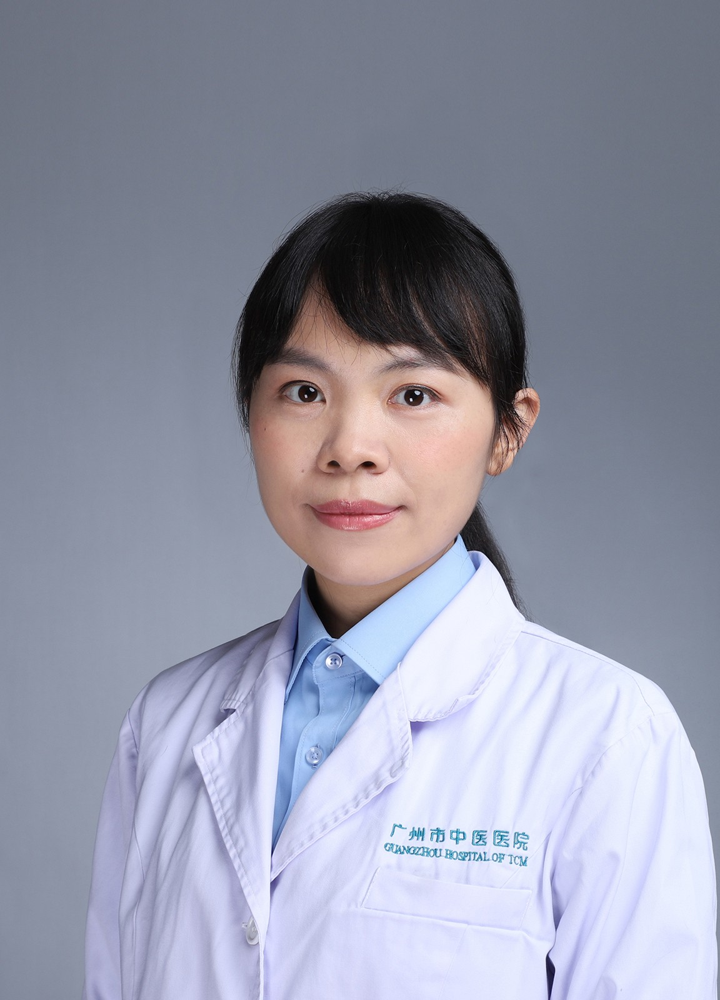

<!-- AUTO-GENERATED-BY: work/generate_obsidian_profiles.py -->

<!-- TEMPLATE: D:\workspace\信息收集整理\医生画像仓库\模板\医生画像模板.md -->

# 何超颖

## 基础信息

| 字段 | 内容 |
|---|---|
| 姓名 | 何超颖 |
| 医院 | 广州市中医院 |
| 科室 | 超声医学科 |
| 职称/身份 | 主治医师 |
| 来源链接 | [官网原文](https://www.gzszyy.com/expert/2026/jneg7Zew.html) |
| 采集日期 | 2026-08-13 |

## 简介/擅长

消化系统、泌尿系统、妇科、心脏、四肢血管和浅表器官等系统常见病、疑难病的超声诊断。

## 教育与进修经历

- 毕业于南方医科大学，已取得中级职称证书，执业医师资格及住院医师规范化培训证书。
- 从事超声临床工作15余年，曾在广东省人民医院进修学习一年。

## 科研项目与成果

- 参与广东省医学科研基金项目1项，发表科研论文多篇，核心期刊论文1篇

## 论文与学术产出

- 参与广东省医学科研基金项目1项，发表科研论文多篇，核心期刊论文1篇

## 可包装亮点

- 从事超声临床工作15余年，曾在广东省人民医院进修学习一年。
- 参与广东省医学科研基金项目1项，发表科研论文多篇，核心期刊论文1篇

## 重点疾病/人群标签

- 慢性病：
- 肿瘤：癌、乳腺癌、疑难
- 生殖疾病：
- 免疫/风湿：
- 术后恢复/康复：
- 疑难重症：癌、乳腺癌、疑难

## 证据摘录

> 只摘录官网公开信息中的短句或关键字段，不复制大段原文。

- 官网身份字段：主治医师
- 官网简介/擅长：消化系统、泌尿系统、妇科、心脏、四肢血管和浅表器官等系统常见病、疑难病的超声诊断。
- 官网亮眼经历线索：从事超声临床工作15余年，曾在广东省人民医院进修学习一年。 参与广东省医学科研基金项目1项，发表科研论文多篇，核心期刊论文1篇
- 来源链接：https://www.gzszyy.com/expert/2026/jneg7Zew.html

## BD 画像摘要

何超颖医生可作为肿瘤、疑难重症方向的基础画像候选。后续 BD 使用应继续以官网来源和人工复核为准，不添加疗效承诺或无来源包装。

## 合规边界

- 仅使用医院官网、官方公众号、官方小程序等公开渠道。
- 不采集私人电话、私人微信、家庭住址、患者隐私或非公开排班信息。
- 不写“保证治愈”“疗效第一”“包治疑难杂症”等无法由官网证明的表述。
