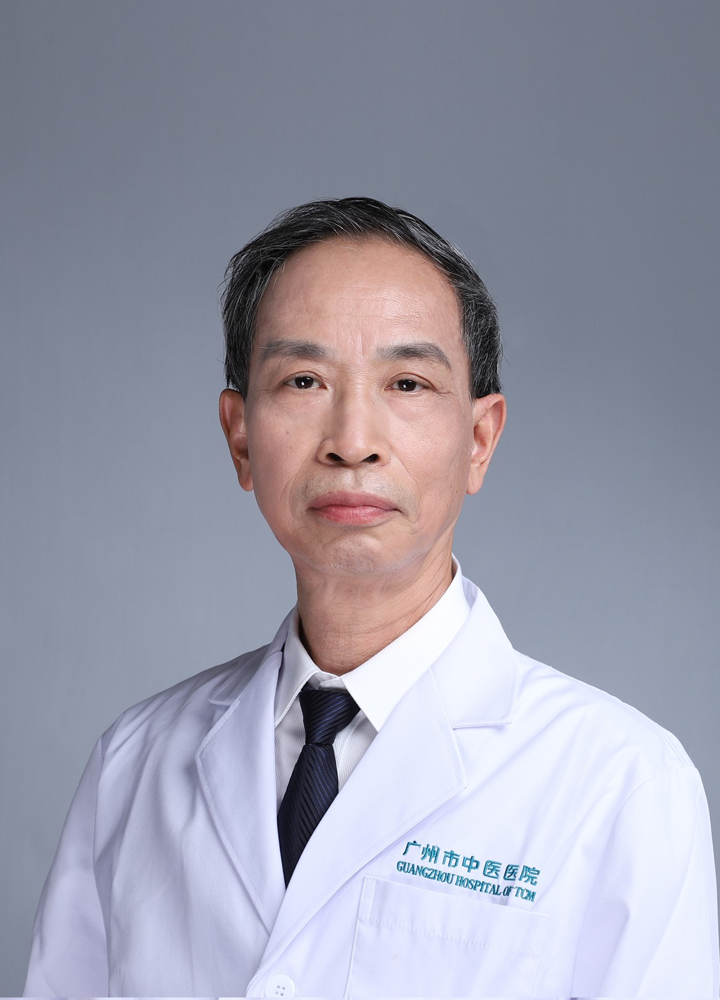

<!-- AUTO-GENERATED-BY: work/generate_obsidian_profiles.py -->

<!-- TEMPLATE: D:\workspace\信息收集整理\医生画像仓库\模板\医生画像模板.md -->

# 刘伟强

## 基础信息

| 字段 | 内容 |
|---|---|
| 姓名 | 刘伟强 |
| 医院 | 广州市中医院 |
| 科室 | 心病科（心血管内科） |
| 职称/身份 | 副主任医师 |
| 来源链接 | [官网原文](https://www.gzszyy.com/expert/2026/YQdJPlaO.html) |
| 采集日期 | 2026-08-13 |

## 简介/擅长

从事临床内科工作近40年，掌握心血管内科常见病和危急重症的诊断和治疗，熟悉内科其他系统常见病的诊断和治疗原则。

## 教育与进修经历

- 内科副教授，1983年毕业于广州医科大学医疗系，2006年于广州中医药大学中西医结合临床研究生班结业。

## 可包装亮点

- 广东省中医药学会心血管专业委员会第三届常委、广东省中西医结合学会心律失常专业委员会第一届常委。

## 重点疾病/人群标签

- 慢性病：高血压、糖尿病、冠心病、心衰、慢性、风湿、重症
- 肿瘤：
- 生殖疾病：
- 免疫/风湿：高血压、糖尿病、冠心病、心衰、慢性、风湿、重症
- 术后恢复/康复：
- 疑难重症：高血压、糖尿病、冠心病、心衰、慢性、风湿、重症

## 证据摘录

> 只摘录官网公开信息中的短句或关键字段，不复制大段原文。

- 官网身份字段：副主任医师
- 官网简介/擅长：从事临床内科工作近40年，掌握心血管内科常见病和危急重症的诊断和治疗，熟悉内科其他系统常见病的诊断和治疗原则。
- 官网亮眼经历线索：广东省中医药学会心血管专业委员会第三届常委、广东省中西医结合学会心律失常专业委员会第一届常委。
- 来源链接：https://www.gzszyy.com/expert/2026/YQdJPlaO.html

## BD 画像摘要

刘伟强医生可作为慢性病、免疫/风湿/感染、疑难重症方向的基础画像候选。后续 BD 使用应继续以官网来源和人工复核为准，不添加疗效承诺或无来源包装。

## 合规边界

- 仅使用医院官网、官方公众号、官方小程序等公开渠道。
- 不采集私人电话、私人微信、家庭住址、患者隐私或非公开排班信息。
- 不写“保证治愈”“疗效第一”“包治疑难杂症”等无法由官网证明的表述。
