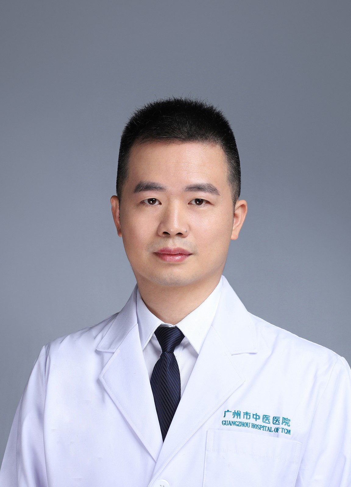

<!-- AUTO-GENERATED-BY: work/generate_obsidian_profiles.py -->

<!-- TEMPLATE: D:\workspace\信息收集整理\医生画像仓库\模板\医生画像模板.md -->

# 刘新宇

## 基础信息

| 字段 | 内容 |
|---|---|
| 姓名 | 刘新宇 |
| 医院 | 广州市中医院 |
| 科室 | 肺病科（呼吸内科） |
| 职称/身份 | 副主任中医师 |
| 来源链接 | [官网原文](https://www.gzszyy.com/expert/2026/openx4b7.html) |
| 采集日期 | 2026-08-13 |

## 简介/擅长

治疗慢性阻塞性肺病、支气管哮喘、慢性咳嗽、间质性肺病、慢性肺源性心脏病等。

## 教育与进修经历

- 毕业于广州中医药大学,中医内科硕士学位，广东省中西结合学会呼吸病专业委员会常委、广东省中医药学会呼吸病专业委员会委员、广州市医师学会呼吸分会委员，广东省名中医师承项目继承人。
- 曾两次到广医一院呼研所进修呼吸内科及肺功能检测。

## 科研项目与成果

- 毕业于广州中医药大学,中医内科硕士学位，广东省中西结合学会呼吸病专业委员会常委、广东省中医药学会呼吸病专业委员会委员、广州市医师学会呼吸分会委员，广东省名中医师承项目继承人。
- 主持或参加课题多项。

## 论文与学术产出

- 共发表相关专业省级以上论文十余篇；

## 可包装亮点

- 毕业于广州中医药大学,中医内科硕士学位，广东省中西结合学会呼吸病专业委员会常委、广东省中医药学会呼吸病专业委员会委员、广州市医师学会呼吸分会委员，广东省名中医师承项目继承人。
- 曾两次到广医一院呼研所进修呼吸内科及肺功能检测。
- 共发表相关专业省级以上论文十余篇；

## 重点疾病/人群标签

- 慢性病：慢性
- 肿瘤：
- 生殖疾病：
- 免疫/风湿：
- 术后恢复/康复：
- 疑难重症：

## 证据摘录

> 只摘录官网公开信息中的短句或关键字段，不复制大段原文。

- 官网身份字段：副主任中医师
- 官网简介/擅长：治疗慢性阻塞性肺病、支气管哮喘、慢性咳嗽、间质性肺病、慢性肺源性心脏病等。
- 官网亮眼经历线索：毕业于广州中医药大学,中医内科硕士学位，广东省中西结合学会呼吸病专业委员会常委、广东省中医药学会呼吸病专业委员会委员、广州市医师学会呼吸分会委员，广东省名中医师承项目继承人。 曾两次到广医一院呼研所进修呼吸内科及肺功能检测。 共发表相关专业省级以上论文十余篇；
- 来源链接：https://www.gzszyy.com/expert/2026/openx4b7.html

## BD 画像摘要

刘新宇医生可作为慢性病方向的基础画像候选。后续 BD 使用应继续以官网来源和人工复核为准，不添加疗效承诺或无来源包装。

## 合规边界

- 仅使用医院官网、官方公众号、官方小程序等公开渠道。
- 不采集私人电话、私人微信、家庭住址、患者隐私或非公开排班信息。
- 不写“保证治愈”“疗效第一”“包治疑难杂症”等无法由官网证明的表述。
