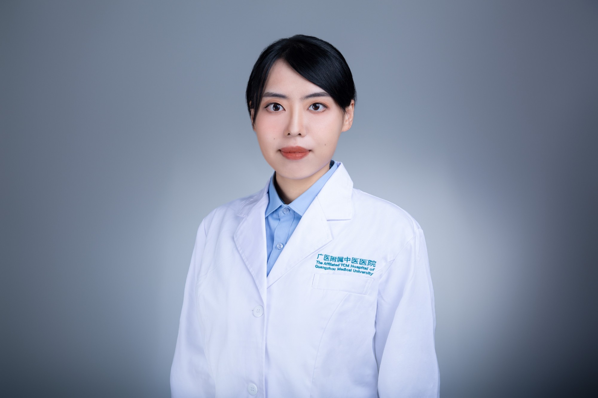

<!-- AUTO-GENERATED-BY: work/generate_obsidian_profiles.py -->

<!-- TEMPLATE: D:\workspace\信息收集整理\医生画像仓库\模板\医生画像模板.md -->

# 吴宇瑶

## 基础信息

| 字段 | 内容 |
|---|---|
| 姓名 | 吴宇瑶 |
| 医院 | 广州市中医院 |
| 科室 | 重症医学科 |
| 职称/身份 | 主治中医师 |
| 来源链接 | [官网原文](https://www.gzszyy.com/expert/2026/YRdGwrdD.html) |
| 采集日期 | 2026-08-13 |

## 简介/擅长

中医药治疗内科疾病。

## 教育与进修经历

- 主治中医师， 医学博士，中西结合博士后，黔南州中医医院合作共建第四批专家组成员，广州医科大学学生导师 中医世家，曾长年跟随广东省名中医黄穗平教授、香港中西医学研究中心吴锦教授（师承中国科学院资深院士陈可冀教授）学习，在中医药治疗内科疾病方面有丰富经验，曾于SCI期刊发表文章3篇（2篇TOP期刊，中科院2区），撰写肿瘤相关著作2部，并在国内期刊于消化等方向发表文章3篇。
- 主持中国博士后科学基金研究、广东省青年基金研究、广东省校院企联合项目、广州医科大学青年基金各1项，独立带领广东省中医药管理局课题研究1项，参与国家自然科学基金研究2项，国家重点研发计划1项，完成广东省中医院重点专项研究2项。

## 科研项目与成果

- 主持中国博士后科学基金研究、广东省青年基金研究、广东省校院企联合项目、广州医科大学青年基金各1项，独立带领广东省中医药管理局课题研究1项，参与国家自然科学基金研究2项，国家重点研发计划1项，完成广东省中医院重点专项研究2项。

## 论文与学术产出

- 主治中医师， 医学博士，中西结合博士后，黔南州中医医院合作共建第四批专家组成员，广州医科大学学生导师 中医世家，曾长年跟随广东省名中医黄穗平教授、香港中西医学研究中心吴锦教授（师承中国科学院资深院士陈可冀教授）学习，在中医药治疗内科疾病方面有丰富经验，曾于SCI期刊发表文章3篇（2篇TOP期刊，中科院2区），撰写肿瘤相关著作2部，并在国内期刊于消化等方向发表文章3篇。

## 可包装亮点

- 主治中医师， 医学博士，中西结合博士后，黔南州中医医院合作共建第四批专家组成员，广州医科大学学生导师 中医世家，曾长年跟随广东省名中医黄穗平教授、香港中西医学研究中心吴锦教授（师承中国科学院资深院士陈可冀教授）学习，在中医药治疗内科疾病方面有丰富经验，曾于SCI期刊发表文章3篇（2篇TOP期刊，中科院2区），撰写肿瘤相关著作2部，并在国内期刊于消化等方向发…
- 主持中国博士后科学基金研究、广东省青年基金研究、广东省校院企联合项目、广州医科大学青年基金各1项，独立带领广东省中医药管理局课题研究1项，参与国家自然科学基金研究2项，国家重点研发计划1项，完成广东省中医院重点专项研究2项。
- 广东省中医药学会疑难病专委会委员，广东省中医药学会脓毒症专委会委员

## 重点疾病/人群标签

- 慢性病：
- 肿瘤：肿瘤、疑难、重症
- 生殖疾病：
- 免疫/风湿：
- 术后恢复/康复：
- 疑难重症：肿瘤、疑难、重症

## 证据摘录

> 只摘录官网公开信息中的短句或关键字段，不复制大段原文。

- 官网身份字段：主治中医师
- 官网简介/擅长：中医药治疗内科疾病。
- 官网亮眼经历线索：主治中医师， 医学博士，中西结合博士后，黔南州中医医院合作共建第四批专家组成员，广州医科大学学生导师 中医世家，曾长年跟随广东省名中医黄穗平教授、香港中西医学研究中心吴锦教授（师承中国科学院资深院士陈可冀教授）学习，在中医药治疗内科疾病方面有丰富经验，曾于SCI期刊发表文章3篇（2篇TOP期刊，中科院2区），撰写肿瘤相关著作2部，并在国内期刊于消化等方向发表文章3篇。 主持中国博士后科学基金研究、广东省青年基金研究、广东省校院企联合项…
- 来源链接：https://www.gzszyy.com/expert/2026/YRdGwrdD.html

## BD 画像摘要

吴宇瑶医生可作为肿瘤、疑难重症方向的基础画像候选。后续 BD 使用应继续以官网来源和人工复核为准，不添加疗效承诺或无来源包装。

## 合规边界

- 仅使用医院官网、官方公众号、官方小程序等公开渠道。
- 不采集私人电话、私人微信、家庭住址、患者隐私或非公开排班信息。
- 不写“保证治愈”“疗效第一”“包治疑难杂症”等无法由官网证明的表述。
