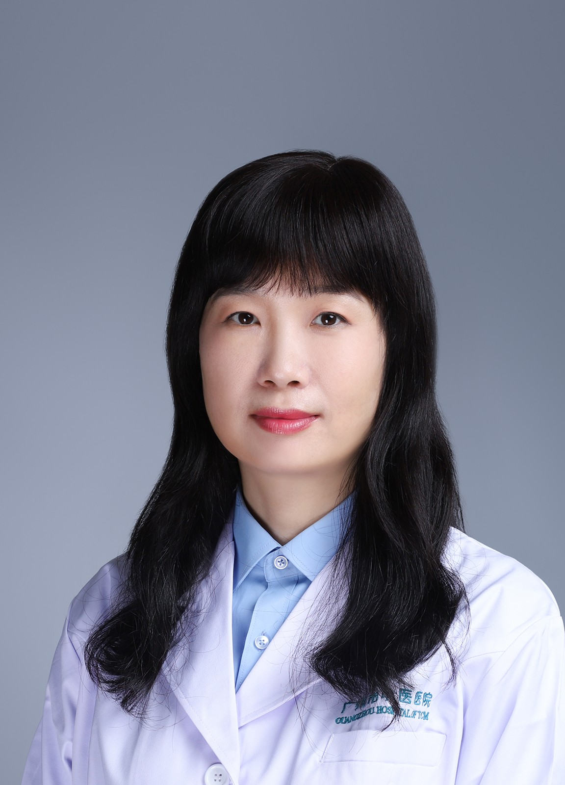

<!-- AUTO-GENERATED-BY: work/generate_obsidian_profiles.py -->

<!-- TEMPLATE: D:\workspace\信息收集整理\医生画像仓库\模板\医生画像模板.md -->

# 吴薏婷

## 基础信息

| 字段 | 内容 |
|---|---|
| 姓名 | 吴薏婷 |
| 医院 | 广州市中医院 |
| 科室 | 肿瘤一区 |
| 职称/身份 | 主任中医师 |
| 来源链接 | [官网原文](https://www.gzszyy.com/expert/2026/4zbqjrdp.html) |
| 采集日期 | 2026-08-13 |

## 简介/擅长

中西医结合治疗肺癌、乳腺癌、鼻咽癌、前列腺癌、甲状腺癌、肠癌、胃癌、胰腺癌、肝癌、卵巢癌等恶性肿瘤；乳腺囊肿、乳腺纤维瘤、子宫肌瘤、甲状腺结节、大肠息肉、脂肪瘤等良性肿瘤。同时擅长用经方治疗感冒、咳嗽、胃痛、腹泻等内科疾病以及颈椎病、腰椎病的内科保守治疗。

## 教育与进修经历

- 1994年江西中医学院本科毕业，2009年广州中医药大学硕士毕业。

## 科研项目与成果

- 主持省中管局课题2项，市卫生局课题1项；
- 参与省、市各项课题十余项。

## 可包装亮点

- 广州市第二批优秀中医临床研修人才；
- 第四批全国优秀中医临床研修人才；
- 第五届羊城好医生。

## 重点疾病/人群标签

- 慢性病：
- 肿瘤：肿瘤、癌、瘤、鼻咽癌、肺癌、肝癌、胃癌、肠癌、乳腺癌、卵巢
- 生殖疾病：肿瘤、癌、瘤、鼻咽癌、肺癌、肝癌、胃癌、肠癌、乳腺癌、卵巢
- 免疫/风湿：
- 术后恢复/康复：
- 疑难重症：

## 证据摘录

> 只摘录官网公开信息中的短句或关键字段，不复制大段原文。

- 官网身份字段：主任中医师
- 官网简介/擅长：中西医结合治疗肺癌、乳腺癌、鼻咽癌、前列腺癌、甲状腺癌、肠癌、胃癌、胰腺癌、肝癌、卵巢癌等恶性肿瘤；乳腺囊肿、乳腺纤维瘤、子宫肌瘤、甲状腺结节、大肠息肉、脂肪瘤等良性肿瘤。同时擅长用经方治疗感冒、咳嗽、胃痛、腹泻等内科疾病以及颈椎病、腰椎病的内科保守治疗。
- 官网亮眼经历线索：广州市第二批优秀中医临床研修人才； 第四批全国优秀中医临床研修人才； 第五届羊城好医生。
- 来源链接：https://www.gzszyy.com/expert/2026/4zbqjrdp.html

## BD 画像摘要

吴薏婷医生可作为肿瘤、生殖疾病方向的基础画像候选。后续 BD 使用应继续以官网来源和人工复核为准，不添加疗效承诺或无来源包装。

## 合规边界

- 仅使用医院官网、官方公众号、官方小程序等公开渠道。
- 不采集私人电话、私人微信、家庭住址、患者隐私或非公开排班信息。
- 不写“保证治愈”“疗效第一”“包治疑难杂症”等无法由官网证明的表述。
