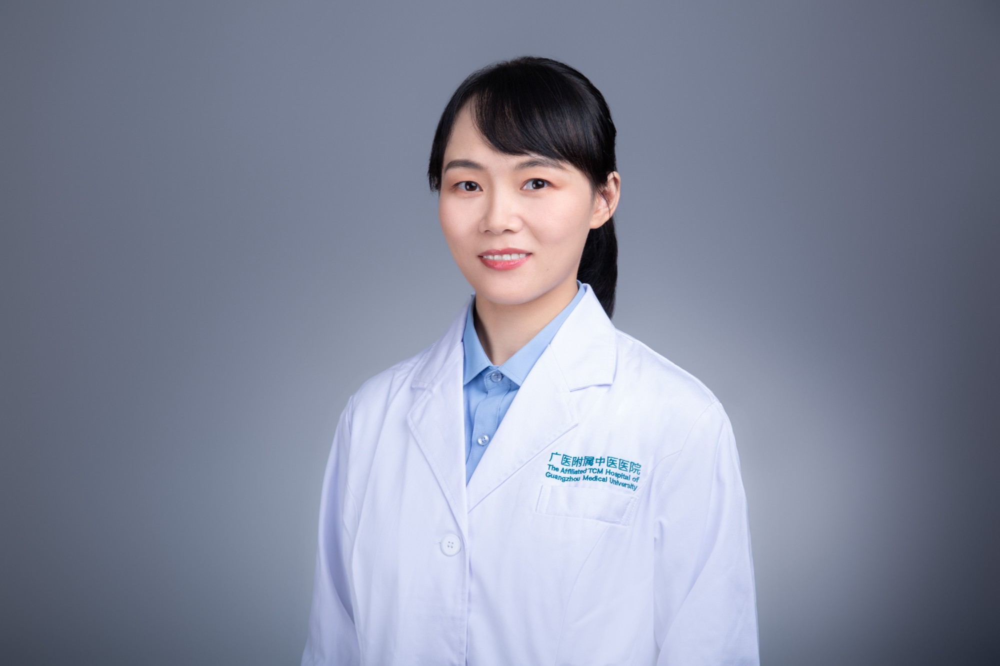

<!-- AUTO-GENERATED-BY: work/generate_obsidian_profiles.py -->

<!-- TEMPLATE: D:\workspace\信息收集整理\医生画像仓库\模板\医生画像模板.md -->

# 夏思

## 基础信息

| 字段 | 内容 |
|---|---|
| 姓名 | 夏思 |
| 医院 | 广州市中医院 |
| 科室 | 血液科 |
| 职称/身份 | 主治医师 |
| 来源链接 | [官网原文](https://www.gzszyy.com/expert/2026/LDdwEma1.html) |
| 采集日期 | 2026-08-13 |

## 简介/擅长

中西医结合诊疗血液系统疾病，中西医结合治疗白血病淋巴瘤、多发性骨髓瘤、骨髓增殖性肿瘤、恶性贫血等血液疾患。

## 教育与进修经历

- 中西结合主治医师， 硕士研究生 毕业于广州中医药大学，擅长中西医结合诊疗血液系统疾病，跟师广东省名老中医丘和明教授学习岭南血证诊治经验，擅长中西医结合治疗白血病淋巴瘤、多发性骨髓瘤、骨髓增殖性肿瘤、恶性贫血等血液疾患。

## 可包装亮点

- 中西医结合诊疗血液系统疾病，中西医结合治疗白血病淋巴瘤、多发性骨髓瘤、骨髓增殖性肿瘤、恶性贫血等血液疾患。

## 重点疾病/人群标签

- 慢性病：
- 肿瘤：肿瘤、瘤、淋巴瘤、白血病
- 生殖疾病：
- 免疫/风湿：
- 术后恢复/康复：
- 疑难重症：

## 证据摘录

> 只摘录官网公开信息中的短句或关键字段，不复制大段原文。

- 官网身份字段：主治医师
- 官网简介/擅长：中西医结合诊疗血液系统疾病，中西医结合治疗白血病淋巴瘤、多发性骨髓瘤、骨髓增殖性肿瘤、恶性贫血等血液疾患。
- 来源链接：https://www.gzszyy.com/expert/2026/LDdwEma1.html

## BD 画像摘要

夏思医生可作为肿瘤方向的基础画像候选。后续 BD 使用应继续以官网来源和人工复核为准，不添加疗效承诺或无来源包装。

## 合规边界

- 仅使用医院官网、官方公众号、官方小程序等公开渠道。
- 不采集私人电话、私人微信、家庭住址、患者隐私或非公开排班信息。
- 不写“保证治愈”“疗效第一”“包治疑难杂症”等无法由官网证明的表述。
