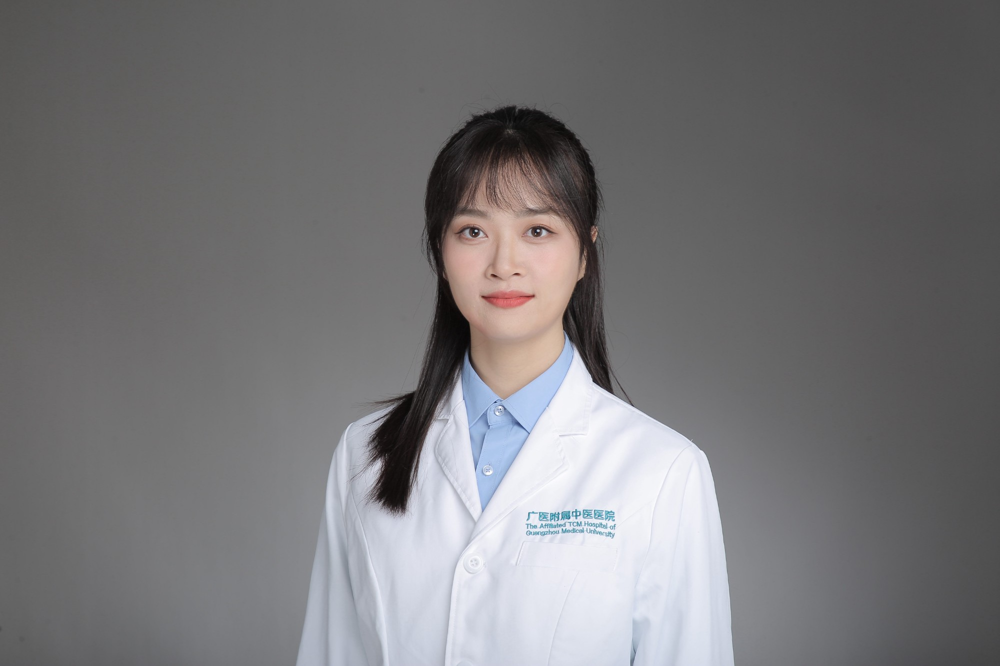

<!-- AUTO-GENERATED-BY: work/generate_obsidian_profiles.py -->

<!-- TEMPLATE: D:\workspace\信息收集整理\医生画像仓库\模板\医生画像模板.md -->

# 孙璇

## 基础信息

| 字段 | 内容 |
|---|---|
| 姓名 | 孙璇 |
| 医院 | 广州市中医院 |
| 科室 | 口腔科 |
| 职称/身份 |  |
| 来源链接 | [官网原文](https://www.gzszyy.com/expert/2026/y5eV5BdE.html) |
| 采集日期 | 2026-08-13 |

## 简介/擅长

各类口腔常见疾病的诊治，如补牙，拔牙，根管治疗，牙周治疗，牙体、牙列缺损的美容修复等。

## 教育与进修经历

- 医师， 口腔医学硕士 毕业于中山大学光华口腔医学院，擅长各类口腔常见疾病的诊治，如补牙，拔牙，根管治疗，牙周治疗，牙体、牙列缺损的美容修复等。
- 于广东省口腔医院完成为期三年国家住院医师规范化培训，在国内外口腔医学专业期刊及基础医学期刊发表SCI论文多篇。

## 论文与学术产出

- 于广东省口腔医院完成为期三年国家住院医师规范化培训，在国内外口腔医学专业期刊及基础医学期刊发表SCI论文多篇。

## 可包装亮点

- 于广东省口腔医院完成为期三年国家住院医师规范化培训，在国内外口腔医学专业期刊及基础医学期刊发表SCI论文多篇。

## 重点疾病/人群标签

- 慢性病：
- 肿瘤：
- 生殖疾病：
- 免疫/风湿：
- 术后恢复/康复：
- 疑难重症：

## 证据摘录

> 只摘录官网公开信息中的短句或关键字段，不复制大段原文。

- 官网简介/擅长：各类口腔常见疾病的诊治，如补牙，拔牙，根管治疗，牙周治疗，牙体、牙列缺损的美容修复等。
- 官网亮眼经历线索：于广东省口腔医院完成为期三年国家住院医师规范化培训，在国内外口腔医学专业期刊及基础医学期刊发表SCI论文多篇。
- 异常提示：职称/身份需人工复核
- 来源链接：https://www.gzszyy.com/expert/2026/y5eV5BdE.html

## BD 画像摘要

孙璇医生可作为广州市中医院口腔科的基础医生资料入库。当前重点方向以总底表标签为准，官网未展示的信息保持空白。

## 合规边界

- 仅使用医院官网、官方公众号、官方小程序等公开渠道。
- 不采集私人电话、私人微信、家庭住址、患者隐私或非公开排班信息。
- 不写“保证治愈”“疗效第一”“包治疑难杂症”等无法由官网证明的表述。
